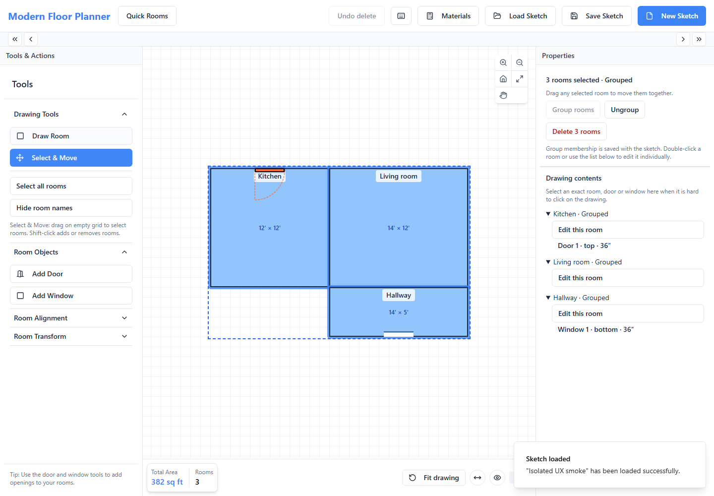
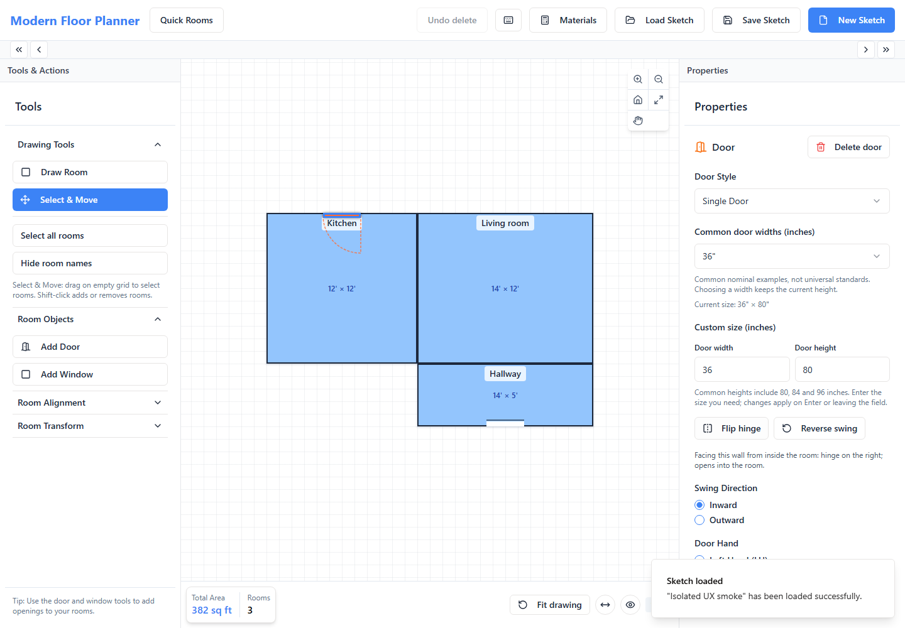

# Sketch selection and opening UX — 2026-09-07

Owning task: [Modern Floor Planner issue #8](https://github.com/armentrout1/ModernFloorPlanner/issues/8), DR-002. The owner explicitly requested whole-house selection/movement, keeping rooms together, individual item editing, label visibility, door swings/sizes, window sizes, and a simpler layout informed by other editors. Baseline: `818f93e4e9c38ff29cc807d8c17075122cf1f165` on clean, synchronized main. The existing Floor Planner task remained the sole checkout writer/release owner. Reviewers researched, reviewed, or drafted outside the checkout. Existing stash and archived unpublished roadmap were retained.

## Interaction decisions and implemented behavior

- **Select all rooms** and guarded Ctrl/Cmd+A select the complete drawing. Select & Move supports Shift-click toggling and one predictable intersecting marquee rule. A selected count and common boundary show the action target.
- **Drag any selected room** to translate the selection by the same model-space delta. Grid/proximity snapping adds one common correction, excluding moving peers. Window-placement constraints compare the proposed moving and stationary sets in both directions; the final snapped position is checked again. A click does not silently snap fractional coordinates.
- **Group rooms / Ungroup** explicitly persist flat membership in optional `room.groupId`. Touching walls do not create implicit groups. Groups do not merge rooms, wall faces, openings, quantities, or physical identities. Selecting a grouped room selects its group. Double-click or Drawing contents allows individual property editing; dragging still moves the group until it is ungrouped. Independent alignment/distribution and transforms cannot silently tear groups apart.
- **Drawing contents** lists rooms and their exact doors/windows. An opening selection clears room selection, so the property panel and delete command identify one target. Expanded narrow hit strips improve canvas selection without making swing arcs clickable. Door/window controls expose explicit Delete door/window labels. After deletion, selection clears so another Delete cannot remove the parent. Multi-room deletion asks once, and Undo delete restores the complete selection and attached objects.
- **Hide/Show room names** changes visibility only. Saved names and dimensions stay unchanged. Drawing tools remain visible; secondary alignment/transform sections are collapsed initially. The old geometry-changing Center Room action is labeled Reposition Room; Fit drawing remains view-only.
- **Flip hinge / Reverse swing** now change the drawn arc on all four walls as well as the stored settings. The inspector states the viewpoint: facing the wall from inside the room. Existing styles, attachments and custom metadata remain intact.
- **Common door widths** preserve height; custom widths/heights accept positive fractional inches. **Common window sizes** explicitly set width and height, with custom entry available. Examples are nominal choices, not universal standards or rough-opening promises. Invalid/empty entries do not invent dimensions. Widths crossing a wall end or overlapping another opening are rejected visibly.
- Legacy windows with no height remain unknown until an explicit entry/preset. Optional `windowProperties.height` stores entered inches in the legacy sketch. This does **not** activate M3B's physical opening forms, synchronized Quick Rooms or quantity integration; the v2 adapter still retains this new metadata without treating it as confirmed physical input.
- Touch opening drags now complete on release. Escape, blur and touch cancellation clear pending opening moves; a second finger cannot restart a cancelled drag. Existing Ctrl-wheel/pinch, middle-pan and fit behavior remain covered.

The legacy JSON payload and JSONB storage are retained. Optional metadata is explicitly validated without a database migration. No graphics engine, domain quantity policy, partner integration, billing, authentication or hosting change.

## Official documentation comparison

Research was limited to official product documentation and used to choose interaction patterns, not to claim feature parity or copy a CAD interface wholesale.

| Source | Documented pattern | Decision here |
| --- | --- | --- |
| [Floorplanner editor manual, April 2025](https://fpcdn.s3.us-east-1.amazonaws.com/static/brochures/Floorplanner-editor-manual-04-2025.pdf) | Shift/rectangle selection, collective actions, contextual door dimensions and hinge/wall-side settings. | Visible selection and contextual property actions; a contents list adds precise selection of small items. |
| [SketchUp selection](https://help.sketchup.com/en/sketchup/selecting-geometry) and [grouping](https://help.sketchup.com/en/sketchup/grouping-geometry) | Select All, modifier selection, bounding boxes, persistent groups and directional marquee behavior. | Adopt explicit flat groups and visible bounds. Keep one marquee rule; omit nested groups and directional CAD selection complexity. |
| [RoomSketcher doors](https://help.roomsketcher.com/hc/en-us/articles/360000808925-How-Do-I-Add-Doors-to-My-Project) and [room labels](https://help.roomsketcher.com/hc/en-us/articles/360000827169-How-Can-I-Add-and-Move-Room-Names) | Door flip/dimensions and editable room labels. Door dimensions include trim in its documented model. | Compact flip controls and label visibility; keep our measurement basis explicit rather than copying its dimension convention. |
| [RoomSketcher grouping limitation](https://help.roomsketcher.com/hc/en-us/articles/14546892866205-Can-I-Copy-and-Move-Multiple-Items-at-Once) | Does not support arbitrary selected-item grouped sets. | Our explicit room grouping addresses this owner's specific need; do not describe it as copied RoomSketcher behavior. |
| [Sweet Home 3D shortcuts, version 7.0](https://www.sweethome3d.com/storage/SweetHome3DShortcuts.pdf) | Select All, furniture grouping, selection rectangles, pan and pointer-centered zoom. | Keep navigation separate from editing. Its furniture grouping is not evidence of architectural whole-house grouping. |

## Verification

Final checks:

| Check | Actual result |
| --- | --- |
| `npm test` | 204/204 passed; zero failures/skips. |
| `npm run check` | Passed with the existing TypeScript configuration. |
| `npm run build` | Passed; 1,796 modules. Existing Browserslist freshness and bundle-size warnings are nonblocking; no dependency update was added. |
| `npx playwright test --workers=2` | All 71/71 passed in 2.6 minutes, zero retries/skips. Includes seven selection/group tests, four all-wall flip tests, custom size validation, actual opening touch/cancellation, and all previous canvas, opening, recovery, Quick Rooms and quantity parity regressions. |
| `git diff --check` | Passed. |
| Local frontend smoke, `http://127.0.0.1:5173/` | Fresh isolated browser, three fixture rooms grouped, hinge visibly changed from left to right, no uncaught page errors. Mocked persistence responses were intercepted in that isolated browser only; no existing saved plan was accessed. Both screenshots below were inspected. |

One full browser checkpoint had 70 passes and one new Escape-cancellation failure. The follow-up probe showed that selecting an opening needed explicit focus and, decisively, gesture cancellation needed capture-phase ordering before parent Escape deselection replaced the listener. The exact case passed after the ordering fix. Ineffective React passive touch cancellation calls were removed in favor of the existing canvas `touch-action` policy; the final touch case also checks that those console errors are absent. The final complete 71-case run above passed after these corrections.

 Earlier checkpoints: 204/204 unit/API/domain checks, 24/24 opening browser checks, and 23/23 selection/canvas/navigation checks passed. Review then identified touch-release/cancellation and grouped-member movement edges; these were fixed and added to the final acceptance suite. The initial typecheck found one Set iteration incompatible with the existing TypeScript target; it was corrected with Array.from without changing compiler settings.

## Release and remaining scope

NOT DEPLOYED. No production smoke, deployment/database/auth binding certification or customer onboarding. Browser persistence tests use the disposable loopback fixture, not production data. Touch verification uses Chromium emulation, not physical phone hardware. The owner's existing app tab was not deliberately reloaded or operated on by acceptance tests; live development updates are distinct from saved-sketch persistence.

General move/resize undo, a full responsive panel redesign, automatic connected-wall topology, physical opening measurement/quantity integration and later roadmap milestones remain separate work. Existing Undo delete remains scoped to room/opening deletions. M3B is still the next eligible canonical milestone on a separate bounded assignment; it has not started. This report is evidence, not a second roadmap.
