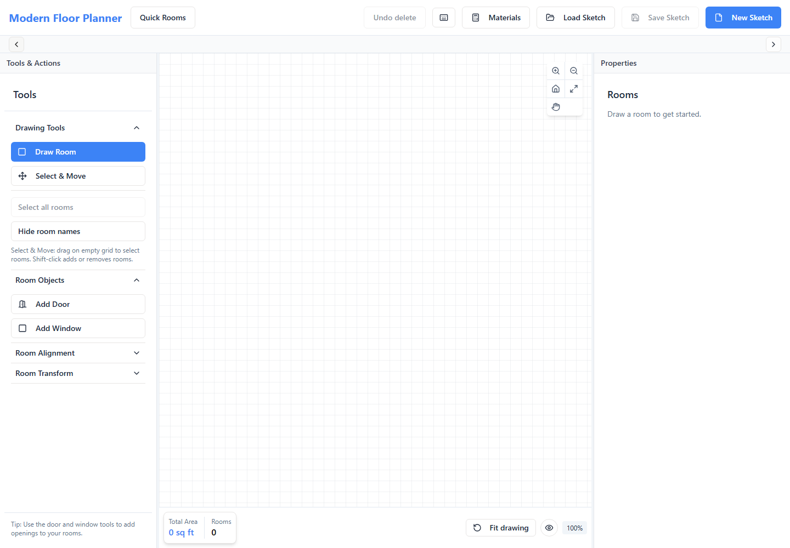
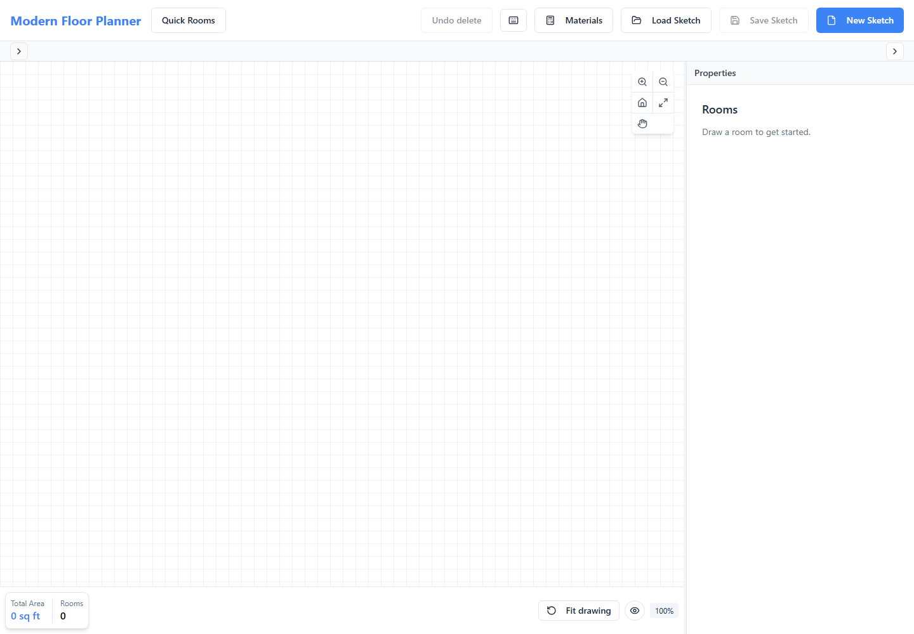
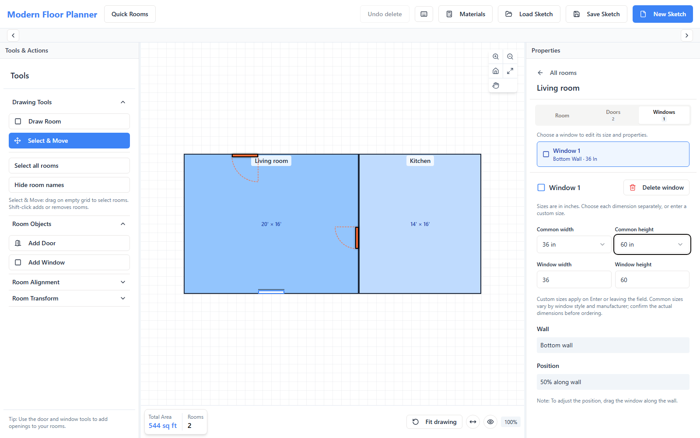
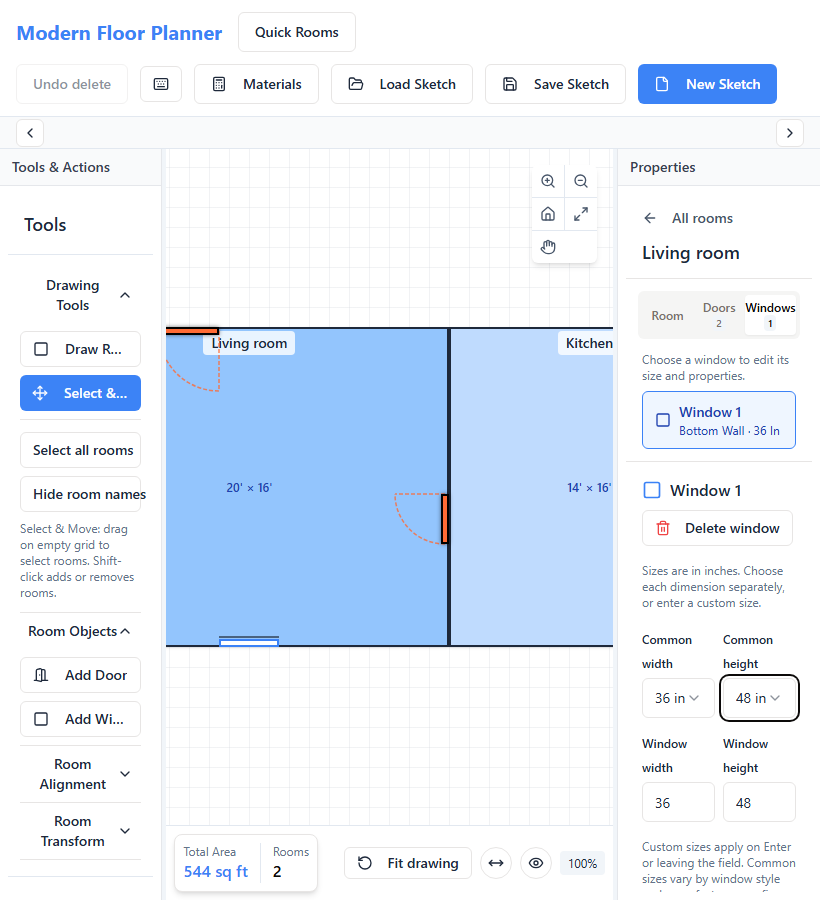

# Sketch selection and opening UX — 2026-09-07

Owning task: [Modern Floor Planner issue #8](https://github.com/armentrout1/ModernFloorPlanner/issues/8), DR-002. The owner explicitly requested whole-house selection/movement, keeping rooms together, individual item editing, label visibility, door swings/sizes, window sizes, and a simpler layout informed by other editors. Baseline: `818f93e4e9c38ff29cc807d8c17075122cf1f165` on clean, synchronized main. The existing Floor Planner task remained the sole checkout writer/release owner. Reviewers researched, reviewed, or drafted outside the checkout. Existing stash and archived unpublished roadmap were retained.

## Interaction decisions and implemented behavior

- **Select all rooms** and guarded Ctrl/Cmd+A select the complete drawing. Select & Move supports Shift-click toggling and one predictable intersecting marquee rule. A selected count and common boundary show the action target.
- **Drag any selected room** to translate the selection by the same model-space delta. Grid/proximity snapping adds one common correction, excluding moving peers. Window-placement constraints compare the proposed moving and stationary sets in both directions; the final snapped position is checked again. A click does not silently snap fractional coordinates.
- **Group rooms / Ungroup** explicitly persist flat membership in optional `room.groupId`. Touching walls do not create implicit groups. Groups do not merge rooms, wall faces, openings, quantities, or physical identities. Selecting a grouped room selects its group. Double-click or Drawing contents allows individual property editing; dragging still moves the group until it is ungrouped. Independent alignment/distribution and transforms cannot silently tear groups apart.
- **Drawing contents** lists rooms and their exact doors/windows. An opening selection clears room selection, so the property panel and delete command identify one target. At this checkpoint, narrow hit strips improved canvas selection; the later owner-assigned door follow-up below also makes the actual swing sector clickable. Door/window controls expose explicit Delete door/window labels. After deletion, selection clears so another Delete cannot remove the parent. Multi-room deletion asks once, and Undo delete restores the complete selection and attached objects.
- **Hide/Show room names** changes visibility only. Saved names and dimensions stay unchanged. Drawing tools remain visible; secondary alignment/transform sections are collapsed initially. The old geometry-changing Center Room action is labeled Reposition Room; Fit drawing remains view-only.
- **Flip hinge / Reverse swing** now change the drawn arc on all four walls as well as the stored settings. This checkpoint labeled the stored hinge side from inside the room; the later door follow-up below corrects displayed handing without relocating saved doors. Existing styles, attachments and custom metadata remain intact.
- **Common door widths** preserve height; custom widths/heights accept positive fractional inches. **Common window sizes** explicitly set width and height, with custom entry available. Examples are nominal choices, not universal standards or rough-opening promises. Invalid/empty entries do not invent dimensions. Widths crossing a wall end or overlapping another opening are rejected visibly.
- Legacy windows with no height remain unknown until an explicit entry/preset. Optional `windowProperties.height` stores entered inches in the legacy sketch. This does **not** activate M3B's physical opening forms, synchronized Quick Rooms or quantity integration; the v2 adapter still retains this new metadata without treating it as confirmed physical input.
- Touch opening drags now complete on release. Escape, blur and touch cancellation clear pending opening moves; a second finger cannot restart a cancelled drag. Existing Ctrl-wheel/pinch, middle-pan and fit behavior remain covered.

The legacy JSON payload and JSONB storage are retained. Optional metadata is explicitly validated without a database migration. No graphics engine, domain quantity policy, partner integration, billing, authentication or hosting change.

## Official documentation comparison

Research was limited to official product documentation and used to choose interaction patterns, not to claim feature parity or copy a CAD interface wholesale.

| Source | Documented pattern | Decision here |
| --- | --- | --- |
| [Floorplanner editor manual, April 2025](https://fpcdn.s3.us-east-1.amazonaws.com/static/brochures/Floorplanner-editor-manual-04-2025.pdf) | Shift/rectangle selection, collective actions, contextual door dimensions and hinge/wall-side settings. | Visible selection and contextual property actions; a contents list adds precise selection of small items. |
| [SketchUp selection](https://help.sketchup.com/en/sketchup/selecting-geometry) and [grouping](https://help.sketchup.com/en/sketchup/grouping-geometry) | Select All, modifier selection, bounding boxes, persistent groups and directional marquee behavior. | Adopt explicit flat groups and visible bounds. Keep one marquee rule; omit nested groups and directional CAD selection complexity. |
| [RoomSketcher doors](https://help.roomsketcher.com/hc/en-us/articles/360000808925-How-Do-I-Add-Doors-to-My-Project) and [room labels](https://help.roomsketcher.com/hc/en-us/articles/360000827169-How-Can-I-Add-and-Move-Room-Names) | Door flip/dimensions and editable room labels. Door dimensions include trim in its documented model. | Compact flip controls and label visibility; keep our measurement basis explicit rather than copying its dimension convention. |
| [RoomSketcher grouping limitation](https://help.roomsketcher.com/hc/en-us/articles/14546892866205-Can-I-Copy-and-Move-Multiple-Items-at-Once) | Does not support arbitrary selected-item grouped sets. | Our explicit room grouping addresses this owner's specific need; do not describe it as copied RoomSketcher behavior. |
| [Sweet Home 3D shortcuts, version 7.0](https://www.sweethome3d.com/storage/SweetHome3DShortcuts.pdf) | Select All, furniture grouping, selection rectangles, pan and pointer-centered zoom. | Keep navigation separate from editing. Its furniture grouping is not evidence of architectural whole-house grouping. |

## Verification

Final checks:

| Check | Actual result |
| --- | --- |
| `npm test` | 204/204 passed; zero failures/skips. |
| `npm run check` | Passed with the existing TypeScript configuration. |
| `npm run build` | Passed; 1,796 modules. Existing Browserslist freshness and bundle-size warnings are nonblocking; no dependency update was added. |
| `npx playwright test --workers=2` | All 71/71 passed in 2.6 minutes, zero retries/skips. Includes seven selection/group tests, four all-wall flip tests, custom size validation, actual opening touch/cancellation, and all previous canvas, opening, recovery, Quick Rooms and quantity parity regressions. |
| `git diff --check` | Passed. |
| Local frontend smoke, `http://127.0.0.1:5173/` | Fresh isolated browser, three fixture rooms grouped, hinge visibly changed from left to right, no uncaught page errors. Mocked persistence responses were intercepted in that isolated browser only; no existing saved plan was accessed. Both screenshots below were inspected. |

One full browser checkpoint had 70 passes and one new Escape-cancellation failure. The follow-up probe showed that selecting an opening needed explicit focus and, decisively, gesture cancellation needed capture-phase ordering before parent Escape deselection replaced the listener. The exact case passed after the ordering fix. Ineffective React passive touch cancellation calls were removed in favor of the existing canvas `touch-action` policy; the final touch case also checks that those console errors are absent. The final complete 71-case run above passed after these corrections.

 Earlier checkpoints: 204/204 unit/API/domain checks, 24/24 opening browser checks, and 23/23 selection/canvas/navigation checks passed. Review then identified touch-release/cancellation and grouped-member movement edges; these were fixed and added to the final acceptance suite. The initial typecheck found one Set iteration incompatible with the existing TypeScript target; it was corrected with Array.from without changing compiler settings.

## Release and remaining scope

NOT DEPLOYED. No production smoke, deployment/database/auth binding certification or customer onboarding. Browser persistence tests use the disposable loopback fixture, not production data. Touch verification uses Chromium emulation, not physical phone hardware. The owner's existing app tab was not deliberately reloaded or operated on by acceptance tests; live development updates are distinct from saved-sketch persistence.

General move/resize undo, a full responsive panel redesign, automatic connected-wall topology, physical opening measurement/quantity integration and later roadmap milestones remain separate work. Existing Undo delete remains scoped to room/opening deletions. M3B is still the next eligible canonical milestone on a separate bounded assignment; it has not started. This report is evidence, not a second roadmap.

## Door handing and swing interaction follow-up — 2026-09-07

Explicit owner assignment on issue #8, based on clean synchronized main `6863b1dbf38653edfb0f732ae36a2468e79368f5`: inward LH/RH labels appeared reversed, placement preview changed its swing after placing, and the whole door/leaf/swept area needed selection and double-click hand flipping.

- Hand labels now use the owner's stated viewpoint: back against the hinge jamb, facing the latch; the arm following the opening swing determines the displayed hand. For inward doors this reverses the old inside-view hinge label. Stored `swingSide` keeps its existing geometric meaning, so previously saved doors do not silently flip. Reverse swing keeps the hinge fixed while the displayed arm-hand changes. The UI explains the viewpoint; this does not implement a manufacturer-specific LHR/RHR ordering code. [JELD-WEN's inward handing guidance](https://www.jeld-wen.ca/en-CA/Articles/projects/replacing-exterior-doors) also distinguishes the outside viewpoint from the previous inside-wall label.
- Placement, drag preview, saved rendering and hit sectors now share the same geometry and renderer. A newly created 36-inch door stores the matching 60 drawing-pixel size. Existing saved sizes, styles, IDs, dimensions, positions and custom metadata are not normalized or migrated.
- Click the door bar, open leaf, arc, or actual swept quarter-circle to select that door. Double-click to flip its hand once, preserving inward/outward direction. The swing turns blue when selected. Its square bounding box outside the real sector is not a catch-all target. The existing Flip hinge and Reverse swing controls remain available.
- Drag the wall opening to relocate it. Sector presses only select, and wall-bar movement needs four screen pixels before relocation. Double-click does not bubble into room/group editing. Pan-owned double-clicks are captured, so Hand/Space/Ctrl navigation cannot flip doors.
- Room backgrounds no longer isolate door symbols in separate stacking contexts, so an outward swing can be selected over an adjoining room while remaining attached to its own room. Touch feedback uses the existing highlight without scaling the room geometry.
- Sliding doors retain their style and no swing/hand action is added. Older doors with no `doorProperties` retain their historical display and remain selectable; double-click does not invent missing width/height/hand settings. Their swing editing remains unavailable until an explicit legacy-property workflow is separately added.

Checks for this follow-up:

- `npm test`: 222/222 passed, zero failures/skips, including 18 geometry/hand compatibility tests.
- `npm run check`: passed.
- `npm run build`: passed, 1,797 modules; existing Browserslist age and bundle-size warnings remain nonblocking.
- `npx playwright test tests/browser/editor.spec.ts tests/browser/canvas-view.spec.ts tests/browser/selection.spec.ts tests/browser/quick-room-navigation.spec.ts --workers=2`: 51/52 passed in 3.0 minutes. The one failed assertion counted the temporary preview as a persisted opening because both shared the same test-ID prefix. The inert preview was given a separate marker and hidden from the accessibility tree; no saved opening was created by the cancelled gesture.
- Final affected-case rerun: `npx playwright test tests/browser/editor.spec.ts tests/browser/canvas-view.spec.ts --grep 'door placement on|cancelled pan consumes' --workers=2`: 5/5 passed in 17.4 seconds, including all four preview/placement/save/reload cases and cancelled-pan persistence. Thus all 52 distinct relevant cases have passing evidence; the entire 52-case set was not rerun after the preview-marker-only adjustment. No retries/skips. Typecheck/build were rerun and passed after that adjustment.
- The passing broader run includes all four walls in both directions, leaf/arc/interior hits, exclusion outside the sector, exact persisted hand flips, outward selection over a grouped neighbor, existing styles/windows/custom sizes, touch drag cancellation, group movement, Ctrl-wheel/two-finger zoom and inactive-route keyboard guards. A dedicated test verifies Hand/Space/Ctrl double-clicks and subthreshold bar movement cannot mutate the door.
- `git diff --check`: passed.
- Fresh isolated frontend smoke at `http://127.0.0.1:5173/`: passed sector selection, inward LH/RH mapping and double-click hand flip, with no uncaught page errors. Mock plan responses stayed in the isolated browser; no owner draft or customer record was accessed. Screenshot inspected below.

NOT DEPLOYED. Production smoke and deployment/database/auth binding remain unverified. No customer onboarding, schema migration, other-product work or later milestone activation. M3B remains next eligible only on a separate bounded assignment.

## Contextual sidebar tabs follow-up — 2026-09-07

The owner explicitly requested research and replacement of the confusing right-side room accordion. Baseline: clean, synchronized main `fff757de9e340cb07994c2534dd35a6cae097631`; this Floor Planner task remained the integration/release owner. Issue #8 records the bounded DR-002 assignment.

Research findings:

- [Floorplanner's official editor manual, pages 8–10](https://fpcdn.s3.us-east-1.amazonaws.com/static/brochures/Floorplanner-editor-manual-04-2025.pdf) exposes room options and items in that room, and shows an object's sidebar when selected.
- [RoomSketcher's door guide](https://help.roomsketcher.com/hc/en-us/articles/360000808925-How-Do-I-Add-Doors-to-My-Project) shows door properties on the right after selecting the door. [SketchUp Entity Info](https://help.sketchup.com/en/sketchup-ipad/entity-info-panel) likewise shows attributes appropriate to the selected entity.
- Our Room / Doors / Windows tabs are a product-specific simplification of these contextual inspectors, not a claim that those products use this exact layout. The existing Radix/shadcn primitive supplies the roles, relationships and keyboard behavior described in the [WAI-ARIA tabs pattern](https://www.w3.org/WAI/ARIA/apg/patterns/tabs/).

Implemented behavior:

- Selected-room name and top tabs remain visible while the properties scroll. Door/window counts stay visible in compact badges. Repeated Properties headings and the duplicate room-object summary were removed.
- Doors and Windows list only the current room's items. Each button shows its per-type number, wall and width; selecting it highlights the exact opening and displays that same numbered item's existing properties. Door widths use the entered door width where available.
- Clicking a room or opening on the canvas synchronizes the room context and tab. All rooms returns to a flat room list, with no details/summary accordion. Multi-selection keeps its Group/Ungroup/Delete controls; choosing one grouped room edits it individually without changing group membership.
- Browsing an opening tab never chooses an item implicitly. It clears the editing selection while retaining the room context, so Delete/Backspace cannot remove a room merely because its empty Doors tab is open. A real new selection discards old browsing state rather than reviving an unrelated room after deselection.
- Tab mouse presses commit valid focused size fields before Radix unmounts their panel; invalid edits remain unapplied. Arrow keys, Home/End and Enter work through the existing accessible tab primitive. Narrow tab labels and delete actions fit the panel instead of overlapping or clipping.
- No geometry, storage schema, quantity engine, opening placement/dragging/swing logic or saved metadata was changed. This is the requested sidebar improvement, not the full M3C responsive-layout milestone.

Actual checks:

| Check | Result |
| --- | --- |
| `npm run check` | Passed, including after final layout classes changed. |
| `npm run build` | Passed; 1,799 modules. Existing Browserslist age and bundle-size warnings remain nonblocking. |
| `npx playwright test tests/browser/selection.spec.ts tests/browser/editor.spec.ts tests/browser/quick-room-navigation.spec.ts --workers=2` | 42/42 passed in 2.2 minutes, zero retries/skips. Includes five new sidebar cases, exact selection, keyboard navigation, empty-tab Delete protection, size blur commits, stale-context prevention, existing grouping/deletion/recovery, all-wall door/window placement, opening styles/swing/dragging, and route guards. |
| Final layout follow-up: `npx playwright test tests/browser/selection.spec.ts --grep 'narrow sidebar'` | 1/1 passed in 11.3 seconds. Added after visual review found narrow tab-label/delete-button crowding; verifies text and action bounds at 820×900. Only layout classes changed after the 42-case run; that full set was not repeated. |
| Local frontend smoke at `http://127.0.0.1:5173/` | Fresh isolated browser: scoped tabs, exact door/window selection, empty editing target before choosing an item, 1600×1000 and 820×900 screenshots, no page errors. Both final screenshots inspected. Mock plan responses were isolated; the owner's tab/drawing was not reloaded or altered. |
| `git diff --check` | Passed. |

Unit/API/quantity suites were not repeated for this sidebar-only change; no calculations or persisted model changed. This follow-up adds six meaningful browser cases rather than duplicating implementation in unit tests.

Producer-verified locally; NOT DEPLOYED. Production smoke and deployment/database/auth binding remain unverified. No customer onboarding, migration or other-product changes. No known blocker remains for this bounded sidebar acceptance. Full phone layout work remains separate; M3B is still next eligible on a separately authorized assignment.

## Single side-panel toggles follow-up — 2026-09-07

Owner-assigned DR-002 repair on issue #8, from clean synchronized main `7aca3592df2053689c64e3aa486320db0a5a3850`. The existing Floor Planner task remained the only MFP release owner; the preserved roadmap archive and stash remain intact.

Each side now has one permanent toggle at its own edge. Left closes left and opens right; right closes right and opens left. The arrow, accessible action name and expanded state match the actual panel. Duplicate full-expand controls and their ineffective width state are removed. Collapse/expand restores the previous resized width. Sidebar children remain mounted while hidden, retaining the selected inspector tab and unapplied field drafts. Resize dividers have a usable four-pixel target and are hidden/disabled for closed panels. Materials uses a bounded, flexible-width scroll area so bottom totals remain reachable.

Actual final checks:

- `npm run check`: passed.
- `npm run build`: passed (1,799 modules). Existing Browserslist age and bundle-size warnings remain nonblocking.
- `npx playwright test tests/browser/canvas-view.spec.ts tests/browser/selection.spec.ts tests/browser/quick-room-navigation.spec.ts tests/browser/panel-materials.spec.ts`: **34/34 passed in 1.8 minutes**, zero retries/skips, against the rebuilt disposable fixture. Four new cases cover both close/reopen orders at desktop/narrow widths, fixed-edge controls, real resize dragging, Enter/Space activation, remembered widths, mounted invalid drafts, retained tabs, and Materials bottom totals at a narrow width/short height. Existing canvas fit, pan, Ctrl-wheel, emulated pinch, opening placement, grouping, deletion/recovery, tab selection and navigation guards passed. Saved-room equality checks passed.
- Earlier iterations exposed a one-pixel divider drag hitting the canvas and visible collapsed dividers; both were corrected. An initial 2.5px far-origin centering check passed with the final divider layout, without changing drawing/zoom logic or weakening the assertion. A repeated run before rebuilding tested stale assets and was not counted as final evidence. The hidden-draft locator was corrected to include hidden elements; element identity and raw draft preservation were then verified.
- Fresh isolated browser at `http://127.0.0.1:5173/`: exactly two controls, fixed positions, zero-width collapse, previous-width reopen and no page errors. Both final screenshots below inspected. Mock plan responses stayed in the isolated browser; the owner's tab and drawing were not operated on.
- `git diff --check`: passed. Unit/API/quantity suites were not repeated for this UI-only repair; no calculation, schema or persisted drawing model changed.

This bounded panel acceptance is complete locally, with no known blocker. NOT DEPLOYED; production smoke and deployment/database/auth binding remain unverified. No customer onboarding, migration or other-product changes. Issue #8 remains open pending release/integration evidence. M3B remains next eligible only on a separate bounded assignment; full phone layout remains separate.

## Independent window-size selectors — 2026-09-08

Owner explicitly requested standard window width and height selectors. Verified existing checkout, remote, clean main at `0e4885f4f73a662dd267efe5a44a70c01abef5a2`, upstream, safe fetch and local task availability before edits. This Floor Planner task owns the bounded DR-002 follow-up to issue #8. The previous issue-body publication permission question remains pending; no new issue mutation was attempted. This local report records the current assignment and result.

The old paired-size menu is replaced by separate Common width and Common height selectors. Width choices: 24, 30, 36, 48, 60, 72 inches. Height choices: 24, 36, 48, 60, 72 inches. Exact custom fields remain alongside them. A pending custom draft displays Custom; explicitly choosing the saved preset restores that field even if its numeric value did not change, without clearing the other dimension's draft.

These are convenient common examples, not a product catalog or universal sizing standard. [Pella's sizing guide](https://www.pella.com/ideas/windows/standard-window-sizes/) distinguishes sizes by window type and cautions that notation can describe either the unit or rough opening. The UI retains a short reminder to confirm actual dimensions before ordering.

Width uses the existing wall-fit/overlap guard and preserves optional height. Unknown legacy heights stay unentered until explicitly chosen. Height changes only height metadata: no width conversion, position change, new width validation or comparison with floor-plan room depth. Saved fractional widths, attachment, IDs and extra metadata remain exact. Opening placement/rendering, door styles and quantity calculations are unchanged.

Actual verification:

- `npm test`: 222/222 passed, no failures/skips. Includes existing quantity/API compatibility checks; run before the final UI-only draft reset adjustment.
- `npm run check` and `npm run build`: passed, including after the final UI adjustment. Existing Browserslist age and bundle-size warnings only.
- Initial `npx playwright test tests/browser/editor.spec.ts tests/browser/selection.spec.ts`: 41 passed, two drag assertions failed. Traces showed the new panel offset was fractional but the mouse event coordinate was integer, placing the drop 0.40625 screen pixels from the requested midpoint. No opening properties were lost. Tests now allow at most one rendered screen pixel for a new drop, compare all other metadata exactly, and require the accepted position to remain exact through later resize. Product geometry was not snapped to satisfy a test.
- Final `npx playwright test tests/browser/editor.spec.ts tests/browser/selection.spec.ts --grep 'window|dragging between|custom opening|changing tabs|narrow sidebar|width, all door'`: **14/14 passed in 55.4 seconds**, zero retries/skips. Includes all-wall window placement/save/reload, both opening drag/resize cases, door styles, independent presets, unknown height, overlapping legacy width with height-only changes, exact custom fractions, rejected widths, same-preset draft recovery, tab commits and narrow layout. Three new browser cases added; the whole broad set was not repeated after the draft-only adjustment.
- Fresh isolated local frontend smoke at `http://127.0.0.1:5173/`: width/height selection updates custom fields, narrow controls stay within the panel, and no page errors. Final 1600×1000 and 820×900 screenshots inspected below. Plan responses were mocked in that browser only; the owner's tab and saved drawing were not operated on.
- `git diff --check`: passed.

Bounded window-selector acceptance complete locally. NOT DEPLOYED; production smoke and hosting/database/auth binding remain unverified. No migrations, customer onboarding or other-product changes. Issue publication remains pending the earlier approval; the implementation itself has no known blocker. M3B remains next eligible only on a separate assignment.
