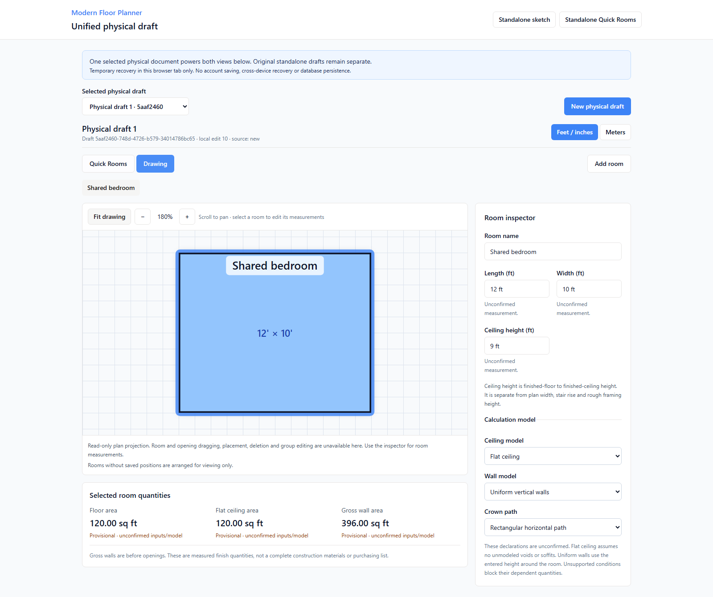

# MFP-M3B implementation results

Date: 2026-09-08
Requirement: DR-002 / [M3B issue #10](https://github.com/armentrout1/ModernFloorPlanner/issues/10)
**Slice 1 COMPLETE locally; Slice 2 eligible, NOT STARTED.** M3B as a whole is still in progress.
Application/test commit: **5e67eaee84f50de16d3209881b2fc28e6fa934e8**. Entry main/origin/main: 77ac8c7c1fd7cfc6cf4732f7b433243b0c771e07.
Deployment: **NOT DEPLOYED**; production/database/auth/partner smoke **NOT VERIFIED**. #2 remains unreleased; #4 remains PROPOSED.

## Implemented application result

The owner's explicit implementation assignment superseded the earlier prerequisite-only stopping instruction. The existing selected design was implemented in the existing React/Vite product. No framework, dependency, live database or hosting change was made.

Open **/physical-draft** for the unified physical workflow. New physical draft creates an empty independent document. Existing standalone Quick Rooms and the legacy sketch offer **Open a physical copy**; the action copies exactly one chosen source into a new selected local draft identity. Existing originals, IDs and source lineage remain intact. Nothing is automatically adopted or merged. The original /quick-room and / workflows remain separate; the two tabs inside /physical-draft share one canonical document.

- **State/provider:** client/src/features/physical-draft/state.ts, store.ts, storage.ts and provider.tsx own the selected full physical draft, raw text/unit context, measurement events, declarations and recovery registry. Shared command guards reject stale target/revision writes. Read-only pixel projections are never synchronized back into a second Room[] store.
- **Views:** pages/PhysicalDraft.tsx, RoomMeasurements.tsx, PhysicalDrawing.tsx and PhysicalQuantities.tsx connect room name, length, width and existing ceilingHeight in both supported views. The existing RoomBox renderer is reused as an inert projection with room selection. Quantities use the existing shared engine and formatter; React contains no takeoff formulas.
- **Compatibility:** shared/compatibility/physicalDraft.ts provides opt-in legacy-pixels-v2 and detached physical-draft-upgrade-v1 operations. Recorded window heights become imported/unconfirmed millimeters; missing heights/sills stay unknown. Original JSON, groups, IDs, door appearance/hinge geometry, conflicting width candidates and historical evidence survive. Unknown physical extensions are refused without changing originals. Captured physical v2 is never silently re-imported from its old compatibility.original.
- **Versioned calculations:** typed room-applicability-v1 and sketch-editor-v1 contracts; rectangular-flat-v2 policy, engine/result/snapshot v2 dispatch and versioned geometry/content fingerprints. Existing pure arithmetic is reused. Frozen v1 behavior and a pre-change golden snapshot remain verifiable.
- **Recovery:** modern-floor-planner:editor-draft:v1 stores a full mfp-editor-draft-v1 registry with selected identity, raw inputs, complete documents/openings/contracts/evidence/settings and no authoritative totals. Original Quick Rooms storage is untouched. Corrupt/future data stays preserved with a download action. Quota/read/CAS failure preserves prior bytes and usable memory state. Physical mode has no legacy API save path.

## Acceptance and fresh final checks

The nine new real-browser scenarios cover explicit empty/Quick Rooms/legacy adoption; same draft/room identity; 12 x 10 x 8 ft producing 120/120/352 sq ft; inspector height 9 producing 120/120/396; reverse length/width/name synchronization; cleared/invalid height masking walls; fractional/metric context and Enter-plus-blur once; view-only fit/zoom/pan; independent unsupported ceiling/wall blocking; same-tab recovery; preserved groups/windows/door outlines; and denied/corrupt/quota recovery with no API writes.

New unit cases: 15 applicability/snapshot regressions, 23 importer/state/recovery regressions, 7 projection regressions. Existing 234 unit and 96 browser regressions remain included, including all existing browser/Node engine parity cases. No old test expectation was weakened or skipped.

Final checks ran after the last application change in the isolated implementation copy using Node 20.20.2 / npm 10.8.2 and Playwright 1.55.1. The following is one fresh sequence, not combined targeted history:

| Command | Actual result | Duration |
| --- | --- | --- |
| `npm ci` | PASS, exit 0 | 11.99 s |
| `npm test` | PASS, exit 0; **279/279**, no failures/skips/cancellations | 1.90 s |
| `npm run check` | PASS, exit 0 | 5.41 s |
| `npm run build` | PASS, exit 0 | 4.32 s |
| `npx playwright test --reporter=line` | PASS, exit 0; **105/105**, one worker, zero retries | 264.53 s |
| `git diff --check` | PASS in the canonical checkout before application commit and final documentation commit. | Not timed |

[Sanitized source/check manifest](evidence/MFP_M3B_SLICE1_2026-09-08.json) binds this code commit, application/test files and raw-log hashes. The full-suite source was compared with the application commit after integration. npm reports the existing 28 advisories (4 low, 10 moderate, 14 high); old browser-data and chunk-size warnings remain. No audit fix or package/lock changes.

Earlier evidence is explicitly separate: initial focused browser run was 8/9 due solely to the new corrupt-message assertion wording; corrected assertion retains exact download/original-byte checks. The first full sequence was 279/279 unit and 104/105 browser: two added header links caused a real compact-inspector viewport regression. Removing the redundant link repaired it without changing the old acceptance test. A focused fitted-view screenshot then exposed a new projection scroll reset; its bounded repair and before/after center assertions are included in the final suite. Earlier failed logs are retained locally and are not counted as passes.

## Preservation and local integration

Implementation development, clean installs and the full automated suites used a disposable tracked-source export in the task workspace. The later canonical smoke is recorded below. No permanent product repository was created. No owner browser tab was navigated, reloaded, inspected or used for tests. No owner .env/database/customer data was copied. The owner's dependencies were not reinstalled.

The connected-client HMR rehearsal of an earlier candidate on a synthetic old 77ac8c7 app **FAILED**: Vite increased page loads from 1 to 3 page loads when new modules/dependencies appeared. It is not safe evidence for hot-applying this patch to an active unsaved legacy editor. No owner source was changed by that rehearsal.

Instead, immediately before integration the canonical checkout/root/remote/main and writer availability were reverified; port 5173 had no listener, prior PID 15820 was absent, and no Vite process watched this checkout. The copy was guarded against an active canonical watcher. With no server watching, file writes could not send hot reload to the old loaded page. Port 5173 remains stopped: restarting it could reconnect its old client and reload unsaved work. The separate review server uses 5176; use a new tab. Do not imply that unsaved browser memory is saved in Git.

Historical stash remains 779950aeaa1b81fc8955ad8f399ab87ae5e59063. Archived original roadmap SHA256 remains 4AA44769A3AF1CC8A4FE940B09E024109FEA19630F61181772B42F7EFDB7BCF1. No reset, forced push, stash apply/drop, archive replacement, destructive migration or customer onboarding occurred.

## Canonical local smoke

A fresh isolated browser context loaded the existing checkout at http://127.0.0.1:5176/physical-draft after integration. It created 12 x 10 x 8 ft, observed 120/120/352 sq ft, changed the inspector to 9 ft and observed 120/120/396, then verified the same IDs and fields through a view round trip. Fit stayed centered with 0 px error before and after full-page capture; view controls preserved the document, events and quantity request. There were zero page errors and zero API writes. The 27 integrated file hashes matched the implementation manifest, and all 213 tracked non-document files were subsequently matched to the application commit after CRLF normalization. The test context closed; the separate review server remains available. This is local smoke, not deployment evidence.

## Populated view and owner checks

1. In a new physical draft add a room, enter 12 ft, 10 ft and 8 ft; check 120/120/352 sq ft.
2. Switch to Drawing, set Ceiling height to 9 ft, then return to Quick Rooms; check the same 9 ft and 396 sq ft walls.
3. Clear height or enter unfinished text: walls become incomplete while floor/flat ceiling remain 120; restore 9 ft and use Fit drawing.

## Limits and single next task

Temporary same-tab recovery is not account, PostgreSQL or cross-device saving. The drawing is read-only apart from selecting rooms; opening placement/editing/deletion/group movement are visibly unavailable here and remain functional in the preserved standalone legacy workflow. Physical doors with no recorded appearance have no invented handed symbol; an available historical source symbol is labeled accordingly. Unknown plan dimensions are not drawn as measured placeholders, and unsupported rendering ranges retain physical data.

Supported proposed/manual/imported measurements and room models remain provisional until explicit review; confirmation/work-surface UI comes later. Sloped/vaulted/stepped/soffit/void and nonuniform wall/path conditions are preserved and block dependent outputs. Room ceiling height is not a plan dimension, stair rise or rough framing height. These three measured quantities are not a full construction materials list: M7 owns specified recipes/coverage/accessories/waste/purchasing; later trade modules need their construction/routing inputs.

**Next: M3B Slice 2 only — synchronized physical opening forms and drawing interactions**, including measured width/height/sill/clockwise center offset/basis, supported appearance, validated placement/movement, deletion/recovery and explicit shared-attachment protection. It is eligible and has not started. Slices 3/4, general M3C work, proposed M3D levels-before-stairs, hosting and database work are not activated.

---

## Historical prerequisite-only and later-brief checkpoints

The record below describes earlier assignments. Its dated stop/eligibility statements are historical; the implementation and current status above supersede them.

# Historical MFP-M3B prerequisite results

Date: 2026-09-08
Requirement: DR-002 / [M3B issue #10](https://github.com/armentrout1/ModernFloorPlanner/issues/10)
Current scope: failed entry-gate prerequisite only.
Gate: **CLEARED LOCALLY - fresh full baseline passed on 09929dd.**
Slice 1: NOT STARTED. Slice 2: NOT ELIGIBLE.
Deployment: NOT DEPLOYED; production smoke NOT VERIFIED.

## Authorization and source

The owner's Slice 1 assignment explicitly says: "If that gate is missing or failed, complete only the missing prerequisite or document the concrete blocker." The entry gate at 8ae503b was BLOCKED by one browser regression, as recorded in [the entry design/evidence](MFP_M3B_ENTRY_GATE.md). This turn therefore repairs and verifies that prerequisite only. It does not implement the shared-document bridge, change the selected design or claim Slice 1 acceptance.

Verified existing repository armentrout1/ModernFloorPlanner, main tracking origin/main, clean at 8ae503ba4626067c7503af887e7cb623b6b76e6d. Safe fetch showed zero ahead/behind; available local task/worktree inventory found no other Floor Planner writer. Issue #10 was claimed with this bounded authorization before editing. Issue #9's latest ceiling/takeoff requirements, repository instructions, canonical roadmap, M2/M3A/editor evidence and opening documentation were read.

Prerequisite source commit: **09929ddc9723e5340b911bc1a30e7373c96dfc18** (`test: measure placement coordinates after canvas reflow`). Changes only tests/browser/canvas-view.spec.ts:182. Application code remains 91402e8ced8b0121b12d1f53e54714d14fe5f173. Publication of the results/roadmap is a separate documentation commit visible in issue #10 and Git history.

## Repair

At 820 x 720, selecting a room adds a footer control, wraps the controls and changes the fitted canvas viewport. The old test captured a room's bounding box before this happened, then used stale coordinates to add a window on a different room.

The test now selects the room, activates Add Window, uses the existing expectCenteredAndVisible polling assertion, and only then captures current bounds/scale for the click. No arbitrary delay, timeout increase, weaker tolerance or changed expected room/wall was introduced. The original non-1-scale, exact window position/size, unchanged other-room data, existing-opening preservation and subsequent resize/save assertions remain intact. No renderer, geometry, sidebar or viewport behavior changed.

The earlier 95/96 run remains failed historical evidence. A separately labeled focused pass cannot replace the fresh complete run below. The first focused CLI invocation used incorrectly delivered Windows grep quoting and exited 1 with No tests found (zero tests executed); that log is retained. Its corrected invocation and the unfiltered full suite are recorded separately.

## Preservation and test isolation

The owner's existing tab at 127.0.0.1:5173 was not inspected, reloaded or operated on. Its server was not restarted and its node_modules were not reinstalled. Only test/documentation files outside Vite's client application root were edited; no shared UI module was changed to trigger application hot replacement. Legacy sketch and Quick Rooms session data were not read or mutated; their persistence is not claimed.

The original stash remains 779950aeaa1b81fc8955ad8f399ab87ae5e59063. Archived original roadmap SHA-256 remains 4AA44769A3AF1CC8A4FE940B09E024109FEA19630F61181772B42F7EFDB7BCF1. No apply/drop, reset, forced push, branch/worktree removal or archive replacement occurred.

All installs, builds and browser tests ran in a fresh disposable tracked-source archive of 09929dd. This is a test directory, not another Git checkout. The owner's .env, live drafts and database data were not copied. Disposable fixtures at 4173/4174 use in-memory APIs and independent browser contexts. Existing evidence for 6b8ef92 was retained.

## Fresh verification

Runtime: Node 20.20.2, npm 10.8.2, Playwright 1.55.1 / Chromium 140.0.7339.186 (build 1193). All 234 tracked files matched commit 09929dd before and after testing: 48 byte-identical and 186 differing only by configured CRLF conversion. Lock blob remains 7dabd1bea25ea1f9bbf87189f07ac71711fc4e62. All five compiled application artifacts are byte-identical to the prior baseline.

| Command / invocation | Actual result | Exit | Duration |
| --- | --- | --- | --- |
| `npm ci` | Added 505 packages; audited 506. | 0 | 7.66 s |
| `npm test` | **234/234 passed**; 0 failed/skipped/cancelled. | 0 | 1.98 s |
| `npm run check` | TypeScript passed. | 0 | 4.91 s |
| `npm run build` | Vite frontend and esbuild server passed. | 0 | 4.21 s |
| Initial focused CLI invocation | No tests found; Windows argument delivery error; zero tests executed. | 1 | 6.36 s |
| `npx playwright test --reporter=line` | **96/96 passed**; one full run, one worker, zero retries. Includes the repaired placement and real-engine parity regressions. | 0 | 253.31 s |
| Corrected focused invocation | **1/1 passed**, zero retries. | 0 | 9.35 s |
| `git diff --check` | Passed in the actual checkout, including staged/final docs. | 0 | Not timed |

Focused command: `npx playwright test tests/browser/canvas-view.spec.ts --grep "opening placement after a scaled fit" --reporter=line`. The harness correction used proper Windows argument delivery, verified separately without a browser. It did not change the test or full command. The full suite ran 14:24:07-14:28:20 UTC on 2026-09-08; corrected focused run followed at 14:28:49-14:28:58 UTC. The full artifacts were retained before the focused invocation; it was not a replacement for full-suite evidence.

npm reported 28 advisories (4 low, 10 moderate, 14 high), plus deprecated esbuild-kit warnings. Build retained old caniuse-lite and main-chunk-over-500-kB warnings. No package/lock/runtime changes or audit fix were applied; scoped advisory review remains issue #4 readiness work. Fixture ports 4173/4174 were released; the owner's 5173 process remained PID 15820.

Evidence is retained in the local task directory work/m3b-entry-gate/evidence-09929dd. A sanitized [current manifest](evidence/MFP_M3B_PREREQUISITE_2026-09-08.json) binds source/lock identity, command results and raw evidence hashes. This is a new full run; no historical counts were combined with targeted tests.

## Four bounded slices in the existing M3B task

| Slice | Scope from the selected entry design | Current state |
| --- | --- | --- |
| 1 | Shared physical draft bridge; synchronized room name, length, width and existing ceilingHeight; explicit supported adoption, versioned compatibility/applicability and full temporary recovery; derived physical sketch and quantities. | NOT STARTED; eligible next, not executed in this prerequisite-only assignment. |
| 2 | Synchronized physical opening forms AND drawing interactions: wall/center offset/width/height/elevation/basis, supported appearance/IDs, validated placement/movement, deletion/recovery and explicit shared-attachment protection. | NOT STARTED; requires Slice 1. |
| 3 | Selected work/surfaces, explainable shared-engine quantities, partial/missing results and explicit measurement confirmation/correction review. | NOT STARTED; requires Slices 1 and 2. |
| 4 | Integrated acceptance, bounded demonstrated-defect repair and M3B closeout; complete user journey, compatibility/recovery, populated viewport checks and current full-suite evidence. | NOT STARTED; requires Slices 1-3. No new feature-design task. |

These partitions live under issue #10 and the sole [canonical roadmap](BUILD_ROADMAP.md). The selected design, source-draft preservation, versioned adapter/snapshot semantics, ceiling-shape applicability and M3B/M7/later-trade boundaries remain unchanged. General undo/responsive gaps remain M3C. No later slice is implicitly activated.

## Outcome and next task

**Entry prerequisite complete locally.** The former 95/96 failure is repaired and a fresh complete 96/96 browser run passes, alongside the unit/typecheck/build checks. The single next implementation task is **M3B Slice 1: shared physical document and synchronized room/ceiling-height editing**, using the existing selected design. It requires the next bounded implementation turn; this assignment stops at prerequisite completion.

Quick Rooms and the legacy sketch still use separate drafts. None of the future Slice 1 synchronization, conversion, recovery or ceiling-height acceptance cases is claimed implemented by this test repair. Slice 2 is not eligible.

No deployment, real PostgreSQL persistence, hosting/authentication validation or originating partner workflow was performed. Production remains NOT VERIFIED / NOT DEPLOYED; dependency advisory review and M4 isolation remain separate readiness gates. No customers were onboarded. Stop after publishing this prerequisite result, as required by the owner's failed-gate condition.

## Subsequent owner briefs: Slice 4 entry remains blocked

The owner supplied explicit Slice 2, Slice 3 and Slice 4 briefs after prerequisite clearance. Fresh fetch for the Slice 4 entry check verified main/origin/main at e663eb52bb5f940807ee7641a81719ae58bf00f8 with a clean working tree. The roadmap, issue and source still show no implemented shared-draft bridge or Slice 1-3 completion evidence. The independent Quick Rooms/legacy draft boundary remains unchanged.

The slice table above now follows those briefs: opening drawing interactions belong to Slice 2; explicit measurement review belongs to Slice 3; Slice 4 verifies integrated acceptance and repairs demonstrated blockers only. The earlier generic assignment of new writable drawing commands to Slice 4 is superseded. No new physical room/group command program is authorized by its closeout brief; preserve supported earlier behavior and leave general undo/responsive gaps in M3C.

**Slice 4: BLOCKED_DEPENDENCY, NOT STARTED.** Slices 1-3 are missing, so there is no unified user journey to certify. No Slice 4 test suite, populated screenshots or manual-acceptance success is claimed. This check only updates task boundaries; prior 234/234 unit and 96/96 browser results remain tied to prerequisite 09929dd, not new feature acceptance. Documentation whitespace/consistency checks are the only new checks.

The single next implementation task remains Slice 1. Slice 2, Slice 3, Slice 4 and M3C are not eligible to start. The latest attachment says Slice 4 ONLY and requires completed Slices 1-3, so those requirements cannot be bypassed by treating the brief itself as completion evidence. Request owner direction to begin Slice 1. No owner-browser operation, source-module change, dependency reinstall, stash/archive change or database operation occurred. NOT DEPLOYED; issue #2 remains unreleased and #4 remains PROPOSED.
