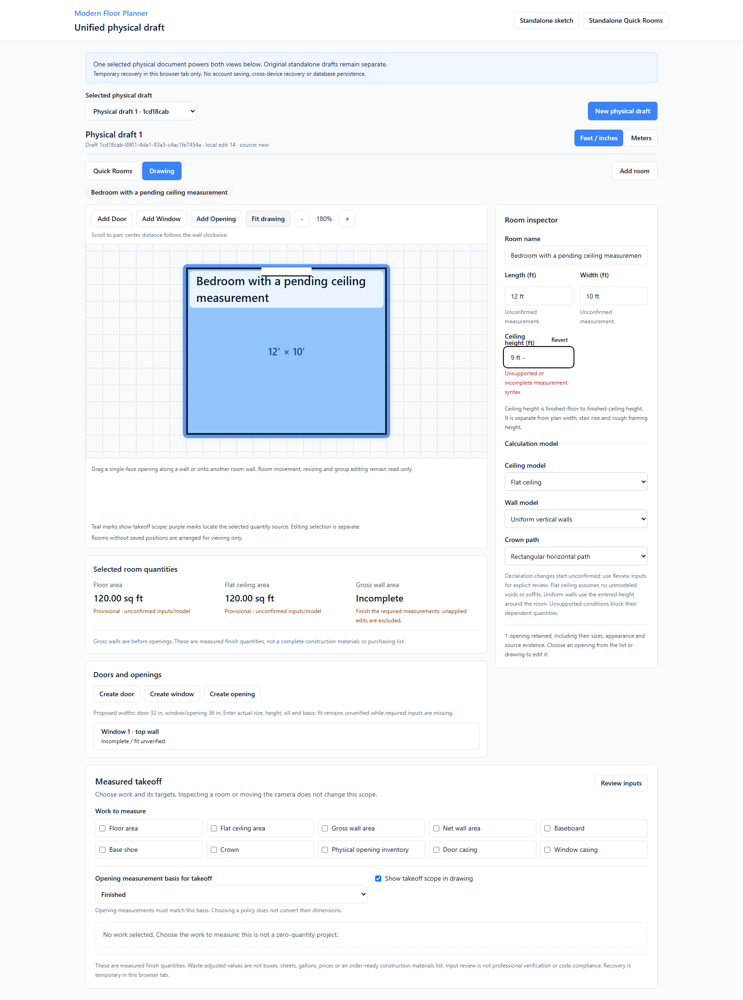

# MFP-M3C field Revert results

Date: 2026-09-08 · [Issue #12](https://github.com/armentrout1/ModernFloorPlanner/issues/12)
**This bounded task is COMPLETE / PRODUCER_VERIFIED locally; NOT DEPLOYED.** M3C as a whole remains incomplete. [M3B Slices 1–4](MFP_M3B_RESULTS.md) remain complete locally; #10 stays open for release tracking.
Entry main/origin/main: `36e10b2c4841e53175afdc8087f60b6b00fe2cb4`. Application/test commit: **`4031c77bf9e19ae2f49d8238ebf19317ce220207`**.

## Behavior and exact preservation

In `/physical-draft`, a visible, field-named **Revert** action and safe input Escape cancel one unfinished room length/width/ceiling-height, opening width/height/sill/center-offset or selected output waste edit. They restore the retained committed value in the active unit and mark only that raw field clean. A committed field is a no-op; this is not historical undo.

Unknown/needs-review values return to blank without resolving candidates; zero sill/offset/waste remain valid zeros. Waste restores its actual committed fraction as a percentage, using plain decimal text even for tiny/large values that JavaScript otherwise formats as exponents. No physical value is parsed from the invalid text or restored from an imported snapshot.

`captureFieldRevert` / `revertField` validate draft identity, revision and exact target/field. Direct before/after assertions preserve the entire document, source, request, provenance, confirmation, applicability, measurement/opening events, review history and other raw fields. Only the target raw field and monotonic guard counters change. Waste Revert advances the existing scope-interaction counter, retaining opening-Undo protection against stale target restoration.

Pointer/touch and Tab+Enter/Space cancel valid-but-uncommitted input without committing first. Tab onward without activation retains normal commit behavior. Cancelling another field does not steal focus and commit the active edit. Handled/repeated/modified/composing Escape and inactive/stale targets are guarded; dialog/menu ownership and standalone legacy input behavior remain intact. Temporary recovery persists clean and pending fields together. Failed writes keep usable memory, prior stored bytes and visible recovery limitations.

## Fresh final checks

After the final code/test change: Node 20.20.2, npm 10.8.2, Playwright 1.55.1.

| Command | Actual result | Duration |
| --- | --- | --- |
| `npm ci` | PASS, exit 0 | 12.85s |
| `npm test` | PASS, exit 0; **369/369** | 3.24s |
| `npm run check` | PASS, exit 0 | 6.33s |
| `npm run build` | PASS, exit 0 | 4.91s |
| `npx playwright test --reporter=line` | PASS, exit 0; **131/131**, zero retries/skips | 348.02s |
| `git diff --check` / `git diff --cached --check` | PASS for application/test and documentation changes | Not timed |

The clean install reported 28 existing dependency advisories (4 low, 10 moderate, 14 high). Build passed with existing stale Browserslist and large-chunk warnings. No dependency or runtime upgrade was included.

All prior **350 unit/125 browser** cases remain unchanged; **19 unit/6 browser** cases are added. [Source/check/log manifest](evidence/MFP_M3C_FIELD_REVERT_2026-09-08.json) binds all **228 frozen files** to the final run, canonical tree and `4031c77bf9e19ae2f49d8238ebf19317ce220207`. Only nine named app/test paths changed. Engine, schema, storage/store, server, lockfile/runtime/config and existing tests are unchanged.

| Coverage | Evidence |
| --- | --- |
| Invalid and valid uncommitted text | Pointer, touch, Tab+Enter/Space and safe Escape; no correction event or lost confirmation |
| One field, units, zero and candidates | All room/opening fields; 12 ft → 3.6576 m; other pending unit contexts retained; zero sill/offset; exact candidate/source preservation |
| Geometry and quantity effects | Geometry-rejected opening edits cancel; floor 120 sq ft restored; actual 10% waste gives 120 + 12 = 132 sq ft |
| Guards and bounded Undo | Malformed/stale/deleted/draft-switched actions; clean no-op; delete→waste edit→Revert→Undo retains newer scope |
| Recovery | Exact navigation/reload; confirmation/evidence retained; quota failure and stale writes preserve usable memory and old bytes |
| Retained regressions | M3B integrated journey, focus/blur/source/scope checks, independent browser/Node engine and historical snapshots |

Focused runs are recorded separately:

| Evidence | Actual outcome | Duration |
| --- | --- | --- |
| `m3c-final-focused-browser.result.json` | Exit 0; 6 passed | 20.48 s |
| `m3c-initial-browser.result.json` | Exit 1; 5 passed, 1 failed | 52.17 s |
| `m3c-revised-browser.result.json` | Exit 0; 6 passed | 19.99 s |

The initial browser harness tried to review pending/disabled Length; it was corrected to clean Width. Two reviewer-discovered lifecycle gaps were fixed within this feature: Tab through Revert must commit on later Tab-away, and cancelling a different field must not blur/commit the active field. The same six cases cover both. A new unit fixture incorrectly expected a 1 ft sill + 7 ft opening to fail an 8 ft wall; changing that rejection fixture to 99 ft fixed the test without changing geometry policy. Final targeted commands passed 19/19. The final full suite includes the last Shift+Escape guard assertion. No existing cases or assertions were removed.

## Rendered evidence and safe review

[Phone pending field and visible Revert](evidence/MFP_M3C_FIELD_REVERT_PENDING_PHONE.png). Both are real final-suite synthetic renders; viewport/touch emulation is not physical-device certification.

Open **http://127.0.0.1:5180/physical-draft** in a new tab with a disposable draft. Listener PID **27124** and all canonical source match the delivered commit. A separate canonical smoke passed **2/2** room and touch/recovery cases in fresh contexts (6.7 s Playwright; 8.85 s command). Its test assertions cover zero page errors and non-read API writes; console-error capture is not claimed.

Owner 5179 tabs/drafts were not inspected, operated on or reloaded. Watcher 23996 (parent 38952) remained protected through isolated checks, then stopped immediately before application integration to prevent hot reload of unsaved work. Old 5173/5176/5177/5178/5179 remain stopped. New 5180 storage does not automatically inherit old drafts; browser memory is not claimed saved to Git or transferred. Stash `779950aeaa1b81fc8955ad8f399ab87ae5e59063` and original-roadmap SHA-256 `4AA44769A3AF1CC8A4FE940B09E024109FEA19630F61181772B42F7EFDB7BCF1` remain unchanged.

No deployment, customer onboarding, database/account/auth migration, purchasing, partner integration or cross-repository work occurred. Production/database/auth/partner smoke is **NOT VERIFIED**. #2 stays unreleased, hosting #4 PROPOSED, #10 open for release, and CRM #11 separate/unmerged. Issue #12 records this bounded implementation only.

## Three owner checks

1. At port 5180, create a disposable 12 × 10 × 8 ft physical draft and select floor work for the room. Type 12 ft - into Length, then Revert: it should show 12 ft and 120 sq ft.
2. Type 13 ft without committing; Tab to Revert and press Enter. The committed length should stay 12 ft. Try the visible Revert on a pending opening field as well.
3. Commit floor waste at 10%, type another unfinished percentage, then Revert: it should return to 10% and 132 sq ft adjusted. Reload this disposable tab and check the reverted fields remain clean.

## Limits and next bounded task

Only this field-cancellation task is complete; general undo/redo, new room/group gestures, levels/stairs, exports, hosting/accounts and purchasing are not added. M3C as a whole remains incomplete; M3B completion is unchanged.

**Recommended next, NOT STARTED: M3C: keyboard navigation for the two physical Quick Rooms / Drawing view tabs.** A separate fresh-browser probe confirmed two clickable `role=tab` buttons, both in the Tab order; ArrowRight and End left focus on Quick Rooms. The recovery bytes remained unchanged and no page errors or API writes occurred. One Tab stop; Arrow keys wrap focus and Home/End move to the endpoints; Enter/Space activate with consistent tab/panel ARIA. Preserve pending input, domain data, evidence and takeoff scope. Retain the already implemented legacy Radix sidebar tabs. This is separate from the completed Revert task; no next implementation starts automatically.
