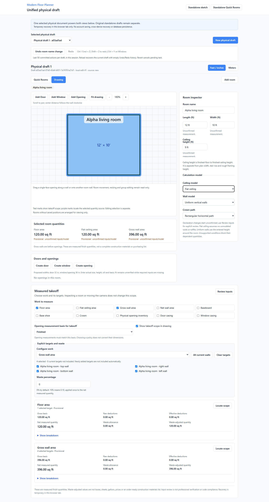

# MFP-M3C committed-edit Undo/Redo results

Date: 2026-09-08 (local) / final run 2026-09-09 UTC. [Issue #14](https://github.com/armentrout1/ModernFloorPlanner/issues/14).
**Assigned Undo/Redo capability COMPLETE / PRODUCER_VERIFIED locally; NOT DEPLOYED. M3C overall remains incomplete.** M3B, field Revert #12 and manual view tabs #13 retain their local completion.
Entry main/origin/main: `3b7938e7f7a3ec32c1a475c33cc3c4e3a3894351`. Application/test commit: **`4a3bd3f6b8a5135cec4b64e43e644c82918eaf21`**. Documentation publication is recorded in issue #14.

## Fresh final verification

One complete ordered run followed the final application/test changes. Node **20.20.2**, npm **10.8.2**, Playwright **1.55.1**. All **236** frozen non-document files match the canonical application; all 36 predecessor test files are unchanged.

| Check | Actual result | Duration |
| --- | --- | --- |
| `npm ci` | PASS | 15.45s |
| `npm test` | 399/399 PASS; zero failed/skipped | 3.63s |
| `npm run check` | PASS | 6.31s |
| `npm run build` | PASS | 4.94s |
| `npx playwright test --reporter=line` | 143/143 PASS; zero retries/skips/failures | 371.37s |
| `git diff --check` and staged whitespace check | PASS for application; documentation checked before commit | Not timed |

The [source/check/evidence manifest](evidence/MFP_M3C_UNDO_REDO_2026-09-08.json) retains source and log hashes, command timestamps, screenshots and preservation evidence. Added **30 unit + 7 browser** cases; prior **369 unit + 136 browser** cases remain. Full results are from this one final source, not combined targeted counts.

Actual UI and direct-data acceptance: a 12 x 10 ft room keeps floor/flat ceiling **120 sq ft** while ceiling 8 -> 9 -> Undo -> Redo gives gross walls **352 -> 396 -> 352 -> 396 sq ft**. Clearing height leaves floor and supported flat-ceiling areas available while wall quantities become incomplete. Door width **32 -> 36 -> 32 in** returns exactly **812.8 mm** and updates measured deductions. One along/between-wall drag is one transaction with exact attachment/offset restoration. Floor waste **10% -> 15% -> Undo** produces **132 -> 138 -> 132 sq ft**, leaving room measurements unchanged. Scope, identities/order, pending text/unit context, source JSON, correction evidence, confirmation rules, snapshots, draft isolation and current temporary recovery are compared directly in the cases below.

Earlier focused runs are separate: first new browser run **6/7 passed** (81.96s); it caught missing targeted recovery after general Redo of deletion. The implementation now renews that guarded token; all original assertions remain. Visual review also caught Windows text-encoding corruption in touched separator text, repaired before final verification. Repaired focused run **7/7 passed** (19.57s). Unit review caught and fixed restoration-source/current-entity binding and request ordering; final regressions retain those checks. Earlier artifacts/logs are preserved locally.

The first full attempt passed **399/399 unit** and **142/143 browser** cases. An existing manual view-tabs focus-order test failed because HistoryControls was inserted between Add room and room selection. Relocating those controls before the draft heading and display-unit controls restored the established focus sequence; predecessor tests were unchanged. The complete fresh rerun reported above followed that repair.

Existing install warnings: **28 advisories (4 low, 10 moderate, 14 high)**. Build passed with stale Browserslist data and large-chunk warnings. No runtime/dependency overhaul was included.

## Genuine screenshots and safe review

[Phone touch/pending-field view](evidence/MFP_M3C_UNDO_REDO_PHONE.png). These are genuine final-suite captures, inspected for readable controls, clean text and narrow layout. Viewport/touch emulation is not physical-device certification.

Open **http://127.0.0.1:5182/physical-draft** in a new disposable tab. Canonical source `4a3bd3f6b8a5135cec4b64e43e644c82918eaf21` returned HTTP 200 on verified listener **16556**. Separate canonical smoke **2/2 PASS** (5.67s), with no page errors or non-read API writes. Console-error capture is not claimed. This additional smoke is separate from the full suite.

Owner preservation: canonical checkout remained untouched through isolated verification. Protected 5181 watcher **36500**, parent **20412**, was reverified and stopped immediately before copying tested source, preventing HMR into an unsaved owner draft. No owner tab was operated on, reloaded or used as a fixture. Old 5173/5176/5177/5178/5179/5180/5181 remain stopped. New-origin storage does not transfer old drafts or save browser memory into Git. Stash `779950aeaa1b81fc8955ad8f399ab87ae5e59063` and original roadmap archive SHA256 `4AA44769A3AF1CC8A4FE940B09E024109FEA19630F61181772B42F7EFDB7BCF1` are unchanged.

Three owner checks, using a disposable draft:

1. Enter 12 x 10 x 8 ft, change ceiling to 9 ft, then Undo and Redo. Gross walls should read 352 / 396 sq ft while floor and supported flat ceiling stay 120 sq ft.
2. Create a door, change its width from 32 to 36 in, move it, and try Undo/Redo. Delete it, use general Undo/Redo, then targeted Undo opening delete: it should restore once and show the history boundary.
3. Commit floor waste 10%, then 15%; Undo should return 132 sq ft for 120 sq ft measured floor. Leave an unrelated invalid field, Undo another action, then reload only this disposable tab: current data/pending text recover with empty history.

## Implemented behavior

Both unified views in `/physical-draft` share visible Undo and Redo controls. Their labels identify the next chronological action, such as a ceiling-height change, door move or floor-waste change. The coordinator belongs to the selected physical draft. Changing views, inspecting another object or changing the camera does not create history or discard a redo branch.

The existing guarded store records semantic committed transactions. A completed opening drag records one move. Enter followed by blur records one committed input change. A room-name editing session coalesces into one action; leaving the field or pressing Enter starts a new session for later typing. Rejected commands and changes that produce no committed difference add no history entry. A new committed action after Undo replaces the abandoned redo branch.

Supported actions are:

| Existing operation | History behavior |
| --- | --- |
| Room creation | Remove/recreate the same room, its original array position, fields and applicability profile. Removal blocks when dependent openings, group references or pending room inputs would be lost. No new room-delete or movement tool was introduced. |
| Room name | Restore the prior/following name as one coalesced editing session. |
| Room length, width and ceiling height, including clearing | Restore the exact retained physical measurement state and reformat the affected clean field in the active display unit. |
| Opening creation/deletion | Preserve ID, ordering, parents, appearance and retained source data; validate restoration against the current document. |
| Opening move/center offset | Restore the exact attachment and physical offset, with existing geometry checks. |
| Opening width, height, sill/elevation, clearing and presets | Restore the exact retained measurement rather than a rounded displayed value. |
| Opening measurement basis and appearance | Change only the corresponding basis or symbol properties. |
| Room ceiling, wall and crown applicability declarations | Restore the declaration provisionally and retain its evidence chain. |
| Takeoff output enablement, explicit targets, opening basis, crown gaps and committed waste | Restore the affected committed request values and original output ordering while preserving unrelated pending waste fields. |

No raw keystroke, field Revert, camera change, source highlight, inspection selection, view-tab focus or panel state is a committed history transaction. Display-unit changes remain presentation changes and do not themselves become an Undo step.

## Inverse transactions and evidence

Undo applies a validated inverse to the current draft; it does not replace the registry or selected draft with an older snapshot. Each action retains typed targets and before/after values. Current values must match the expected source of the inverse. Missing or reused identities, missing parents, unsafe geometry and conflicting pending fields produce an explanation and leave the current draft and history stacks unchanged. The coordinator never silently skips an unsafe top entry to undo an older unrelated edit.

The additive local evidence contract is `physical-history-evidence-v1`. Its commit, undo, redo and boundary events retain transaction/source-event identities, timestamps, labels and typed changes. Restoration validation checks the source transaction and before/after relationship; entity replay is compared with current geometry and metadata after subsequent leaf changes. Output-selection positions preserve exact request order. Existing raw-field and recovery validators remain authoritative for visible text and unit consistency.

Original measurement, opening and review evidence is retained. Restoring a changed known measurement preserves its recorded provenance but makes it unconfirmed; it is not represented as a new field measurement or a renewed approval. An unknown or needs-review measurement retains its actual reason and candidate list. Undo does not select a candidate or invent a missing dimension. Applicability restoration records a declaration transition from the actual current declaration to the restored unconfirmed one.

Restoring an unchanged deleted entity is different from reversing a measurement correction: its already-retained approvals remain with that same entity when existing evidence still validates. This does not grant new confirmation. Explicit review is still required for restored changed measurements and declarations. The original shared measurement-event schema, quantity engine/policy versions and frozen v1/v2 snapshot formats are unchanged. Historical snapshots remain independently verifiable.

Registry, draft and scope-interaction counters do not move backward. The accepted in-memory registry and its history availability are published together. Cache failure does not undo a successful in-memory action or consume an unsuccessful one.

## Explicit boundaries and scope protection

- History is limited to the latest 50 committed transactions per draft. Its Undo/Redo availability lives in the current page session and survives switching views and drafts. Reload recovers the latest valid draft and retained evidence with empty history, as the control help explains. This is not durable revision storage.
- Measurement confirmation, applicability confirmation and explicit candidate resolution create a visible history boundary. Both stacks are cleared after the successful review operation; review approvals cannot be undone by silently crossing that boundary.
- The existing targeted `Undo opening delete` retains its recovery behavior. A successful targeted restoration creates an explicit boundary and clears the general stacks, preventing duplicate restoration or stale redo. A failed targeted restoration leaves both stacks intact. General restoration of that deletion consumes the matching targeted token. General Redo of the original committed deletion creates a fresh guarded targeted recovery token from the current entity, request and monotonic scope revision; Undo of creation does not invent targeted delete recovery.
- Opening deletion or movement can automatically prune unavailable takeoff targets. Their inverse restores that pruned scope only when the existing scope-interaction revision still matches. Later scope or raw-waste interaction, including edit followed by Revert or a subsequently undone scope action, prevents automatic reselection. In that case geometry can be restored while the later takeoff state is preserved, and the interface explicitly explains that previous pruned targets were not reselected.
- A pending field that conflicts with the next inverse must be Applied or Reverted first. Other raw fields retain their exact text, dirty flag and original unit context. A request inverse preserves independent raw waste; it does not restore an old `takeoffState` wholesale.

## Input and gesture safety

Pointer activation of Undo/Redo prevents the initiating press from blurring and committing pending text first, including touch. Keyboard focus onto the history control also uses the physical input's deferred-commit path. The same bypass applies to delayed composition completion. The controls retain native Enter/Space activation, and Space does not arm canvas panning.

Ctrl/Cmd+Z, Ctrl/Cmd+Shift+Z and the supported Ctrl+Y handler act through the selected draft's guarded coordinator. Native text undo keeps ownership inside editable controls. Handled/repeated events, IME composition, dialogs/menus, inactive routes and competing drawing gestures remain guarded. Captured draft identity/revision rejects a stale pointer or keyboard action. Field Revert and the completed manually activated physical view tabs retain their separate behavior.

## Acceptance coverage map

All cases listed below passed in the final fresh full suite. The 21 coordinator cases in `tests/physical-history.test.ts` additionally cover numerical round trips, history limit/coalescing, no-ops, failure/cache handling, full supported command inventory and forged restoration evidence.

| Acceptance area | Existing case(s) |
| --- | --- |
| Chronological height/clear/name behavior, both views | Browser: `committed height, clearing and coalesced room names undo chronologically across both views` |
| One opening move transaction, precise widths, coordinated recovery | Browser: `opening moves and fractional sizes are single reversible transactions, with coordinated delete recovery` |
| Waste/targets, pending conflicts, branch invalidation | Browser: `waste and target Undo preserve unrelated raw input, block conflicting edits and invalidate redo only on commit` |
| Confirmed correction, provisional compensation, recovery | Browser: `confirmed corrections undo provisionally without erasing review snapshots, then recover with empty session history` |
| Separate drafts, safe room removal, cache failure | Browser: `histories remain draft-local and room creation unwinds safely; failed cache writes retain in-memory Undo` |
| Native keyboard, dialogs, composition, stale activation and gestures | Browser: `history shortcuts respect native editing, dialogs, IME, stale targets and active gestures` |
| Phone touch and keyboard with unrelated pending text | Browser: `phone history controls support touch and keyboard without committing unrelated pending text` |
| Stale revision and wrong draft | Unit: `history rejects stale revisions and foreign draft identities without consuming either stack` |
| Missing/reused target and in-place mutation rejection | Unit: `missing targets, reused domain IDs and mutation of frozen state fail without erasing history` |
| Failed targeted recovery retains general history | Unit: `failed targeted opening recovery preserves the newer chronological undo entry` |
| Imported conflicting candidates and original JSON | Unit: `correcting and undoing an imported conflict restores exact candidates, provenance and original JSON` |
| Imported unknown and explicit clear | Unit: `undo of an entered imported unknown restores its reason; clear/undo keeps exact retained evidence` |
| Frozen snapshot verification and provisional restoration | Unit: `old v1/v2 snapshots still verify after correcting, undoing and redoing a confirmed imported value` |
| Non-reversible review boundaries | Unit: `explicit measurement/model confirmation and candidate resolution create visible chronological boundaries` |
| Related/unrelated pending values and display-unit changes | Unit: `undo preserves unrelated raw text and old unit contexts, but blocks the conflicting field until Revert` |
| Exact output ordering and another output's dirty waste | Unit: `undoing output removal restores its exact request order without overwriting another output raw field` |

Browser cases are in `tests/browser/physical-history.spec.ts`. The independent boundary cases are in `tests/physical-history-boundaries.test.ts`. All 30 new unit cases and all seven new browser cases are included in the complete final run above; earlier focused runs are not combined into that count.

## Preservation and limitations

The same React/Vite application, renderer and shared quantity engine remain in use. No hosted release, account saving, database persistence, migrations, cross-product work or customer onboarding occurred. Temporary browser recovery is neither professional verification nor permission to issue an estimate. Storage conflicts and failures preserve the currently usable memory draft and existing recoverable bytes with a visible limitation.

The protected owner session, original imports, historical snapshots, unrelated standalone workflows and existing legacy sidebar tabs are outside this change. Physical Undo/Redo does not claim new room/group gestures or a new legacy-editor history capability. No full screen-reader or physical-phone certification is implied by DOM checks and viewport/touch emulation.

Keep **NOT DEPLOYED**. M3B issue #10 remains the release tracker, issue #2 remains unreleased, hosting #4 stays PROPOSED, and the CRM proposal stays separate. M3B, field Revert and manual view-tab navigation retain their recorded completion; this report only addresses committed-edit Undo/Redo.

## Already-agreed remaining M3C acceptance

The canonical roadmap's **M3 entry and exit criteria** define M3C as responsive docked layout, proper input focus, Undo/Redo and unobstructed controls. Its **A3 - Keep drawing state separate from editing gestures** section specifies docked content that shrinks to available width, a center area with min-width: 0, an inspector drawer on narrow screens and reserved collapse/resize controls. These are existing requirements in [BUILD_ROADMAP.md](BUILD_ROADMAP.md), not new scope. Completed evidence already exists for the bounded legacy panel/centering/opening-control repairs, physical field Revert and manual physical view tabs. This assignment adds committed physical-draft history with complete local acceptance; it does not certify all M3C requirements.

The next assignment should be the already-agreed responsive/layout and focus acceptance package: verify the complete populated workflow across desktop, tablet and phone; ensure docked content shrinks correctly, the narrow-screen inspector drawer remains usable, collapse/resize controls occupy reserved space, and no fields or actions are hidden or covered. Retain keyboard-only form use, visible focus, dialog/selection context, pending-input protection and opening placement on all walls at representative zooms. Use the existing evidence to distinguish retained completed repairs from actual remaining gaps instead of repeating completed issue #8 work. Freely floating sidebars remain outside the initial release.

The roadmap's pilot target—at least four of five representative users completing a basic room without assistance in under two minutes after one explanation—is still a hypothesis requiring measurement, not an achieved result. Do not add an unsolicited convenience feature, claim all M3C complete, or begin the closeout package or M3D automatically.
