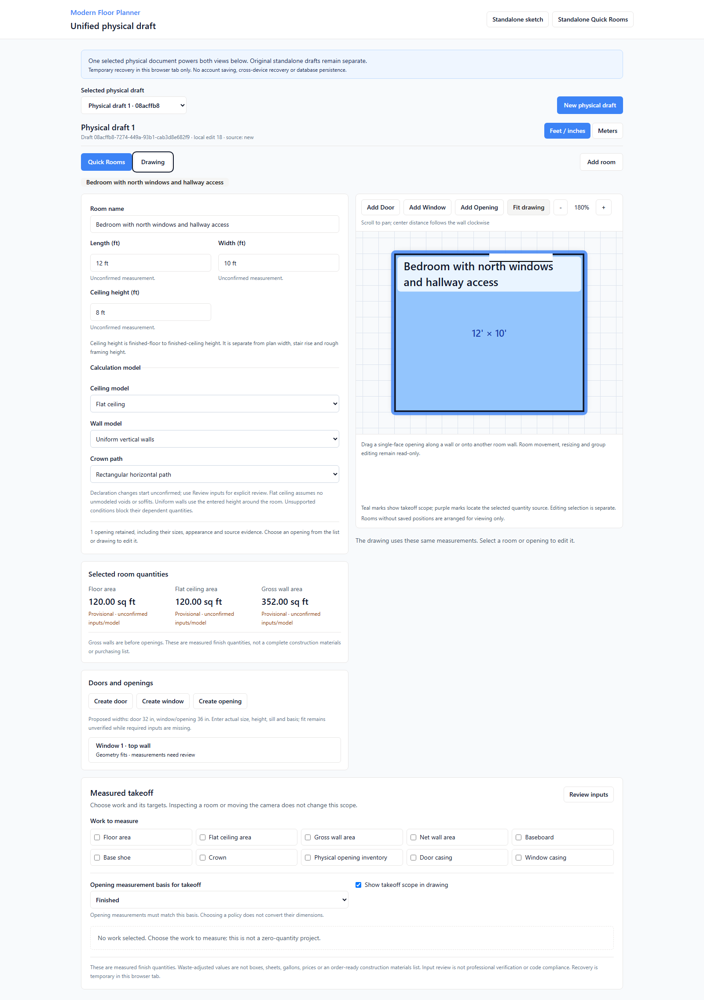

# MFP-M3C physical view-tab keyboard results

Date: 2026-09-08 · [Issue #13](https://github.com/armentrout1/ModernFloorPlanner/issues/13)
**This bounded task is COMPLETE / PRODUCER_VERIFIED locally; NOT DEPLOYED.** M3C as a whole remains incomplete. M3B and [field Revert](MFP_M3C_FIELD_REVERT_RESULTS.md) remain complete locally.
Entry main/origin/main: `21ec2c07051979e8a011f3292f32c5a832f2a431`. Application/test commit: **`c69d9ec1659c3eb9c9b37a8c597b8ed46b6249d3`**.

## Implemented behavior

The Quick Rooms / Drawing tabs inside `/physical-draft` now use manual activation following the requested [WAI-ARIA APG pattern](https://www.w3.org/WAI/ARIA/apg/patterns/tabs/examples/tabs-manual/). One tab is in the sequential Tab order; keyboard entry returns to the selected view. Left/Right wrap focus and Home/End reach the endpoints without selecting another view. Enter/Space activate once through native buttons; pointer/touch continue to work. Tab/Shift+Tab leave normally, and Up/Down retain their ordinary horizontal-tablist behavior.

The named tablist, selected states, stable tab/panel IDs and ARIA relationships agree. Keyboard focus has a distinct visible indicator. Only the active view-specific panel is exposed; the editor and physical document are not duplicated. Programmatic Locate/Edit source changes update selected-view semantics without gratuitously moving focus from the invoking control. The completed legacy sidebar tabs are unchanged.

Handlers are scoped to the tab buttons. Inputs, selectors, review dialogs, IME, Revert/Escape and drawing gestures retain their own behavior. Activating an already active tab does not reset selection or generate measurement events. Ordinary input blur/Enter still commits normally; tab-only invariance is measured after reaching the widget or with intentionally invalid pending text.

## Fresh verification and state preservation

After the final application/test edit: Node 20.20.2, npm 10.8.2 and Playwright 1.55.1.

| Command | Actual result | Duration |
| --- | --- | --- |
| `npm ci` | PASS, exit 0 | 12.70s |
| `npm test` | PASS, exit 0; **369/369** | 3.73s |
| `npm run check` | PASS, exit 0 | 7.26s |
| `npm run build` | PASS, exit 0 | 4.84s |
| `npx playwright test --reporter=line` | PASS, exit 0; **136/136**, zero retries/skips | 348.35s |
| `git diff --check` / `git diff --cached --check` | PASS for application/test and documentation changes | Not timed |

All **369 unit/131 browser** predecessor cases remain unchanged. The task adds **5 browser cases**, no unit cases. [Source/check/log manifest](evidence/MFP_M3C_VIEW_TABS_2026-09-08.json) binds all **230 frozen files** to the final suite and exact canonical source. Only `PhysicalDraft.tsx`, new `PhysicalViewTabs.tsx` and new `physical-view-tabs.spec.ts` changed. No engine, policy, schema, recovery, dependency, server or legacy-tab changes occurred.

| Acceptance | Evidence |
| --- | --- |
| A–D: entry, focus, activation and exit | One Tab stop, selected-tab re-entry, Left/Right wrapping, Home/End focus only, Enter/Space and pointer/touch activation, normal Tab/Shift+Tab exit and inactive-panel exclusion |
| E: local keyboard ownership | Inputs/selectors/dialogs retain keys; safe Revert/Escape and IME remain scoped; no global arrow handlers |
| F/H: pending-state and domain invariants | Invalid room/opening text and unfinished waste survive both views and recovery; direct document/request/raw/evidence/confirmation/selection comparisons; no API writes |
| G: source interactions | Locate/Edit source synchronize tab/panel semantics while preserving takeoff scope and intended editing identity |
| Existing protections | Full M3B journey, field Revert, opening Undo and browser/Node quantity/snapshot parity regressions retained |

Earlier focused runs remain separate from the fresh full count:

| Evidence | Actual outcome | Duration |
| --- | --- | --- |
| `initial-focused.result.json` | Exit 1; 4 passed, 1 failed | 26.65 s |
| `ready-focused.result.json` | Exit 0; 5 passed | 20.03 s |
| `revised-focused.result.json` | Exit 1; 4 passed, 1 failed | 24.17 s |

The first focused run passed 4/5; its new harness incorrectly queried background tab roles while an open review modal correctly hid them. The test now checks their retained ID-based DOM state and still asserts modal hiding. The revised run also exposed a harness race: Escape was sent before the reopened dialog had established focus. The final test waits for visible, focused dialog controls before Escape; no fixed sleep or weakened assertion was added. Both harness failures are retained above.

Warnings: 28 vulnerabilities (4 low, 10 moderate, 14 high). Build also reported stale Browserslist data. Build also reported a large-chunk warning. No unrelated upgrade was introduced. DOM checks, viewport/touch emulation and screenshots do not constitute complete screen-reader or physical-device certification.

## Genuine focus evidence and local review

[Phone keyboard-focus view](evidence/MFP_M3C_VIEW_TABS_FOCUS_PHONE.png). These are actual final-suite synthetic renders.

Open **http://127.0.0.1:5181/physical-draft** in a new tab with a disposable draft. Listener PID **36500** and all canonical source match the delivered commit. A separate canonical smoke passed **2/2** keyboard and touch cases in fresh contexts (6.3 s Playwright; 7.82 s command). Its test assertions cover zero page errors and non-read API writes; console-error capture is not claimed.

The owner's 5180 tab/draft was not inspected, operated on or reloaded. Verified watcher 27124 (parent 30900) stayed protected through isolated checks, then stopped immediately before canonical application integration to prevent hot reload of unsaved work. Old 5173/5176/5177/5178/5179/5180 remain stopped. New 5181 session storage does not inherit old drafts; browser memory is not claimed saved to Git or transferred. Stash `779950aeaa1b81fc8955ad8f399ab87ae5e59063` and original-roadmap SHA-256 `4AA44769A3AF1CC8A4FE940B09E024109FEA19630F61181772B42F7EFDB7BCF1` remain unchanged.

No deployment, hosting, accounts, database migration, customer onboarding, partner integration or cross-product work occurred. Production/database/auth/partner smoke is **NOT VERIFIED**. Issue #10 stays open for release, #2 unreleased, #4 PROPOSED, and CRM work separate.

## Three owner checks

1. Open a disposable draft at port 5181. Tab to the view tabs: Left/Right and Home/End should move focus while the displayed view stays unchanged.
2. Press Enter or Space to activate the focused tab, then Tab or Shift+Tab away. Try tapping both tabs on a narrow view; the visible panel and selected tab should agree.
3. Leave an invalid room/opening value and unfinished waste, switch views, then reload this disposable tab. Confirm the pending text remains and Revert still works.

## Remaining agreed scope

Only this bounded tab task is complete. M3B and field Revert completion remain intact; all M3C is not complete. Already-agreed remaining M3C responsive/docked-layout, focus/usability and general undo/redo requirements remain unstarted where not previously completed. No new polish task is introduced or automatically started. Room/group gestures, levels/stairs, purchasing, exports, hosting/accounts and later milestones remain outside this assignment.
