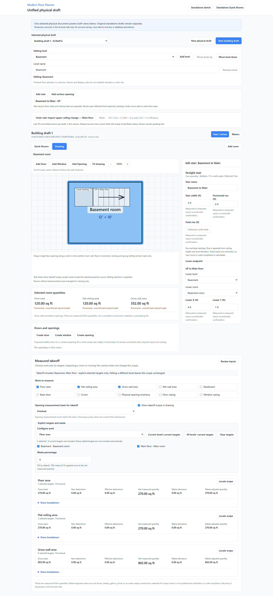
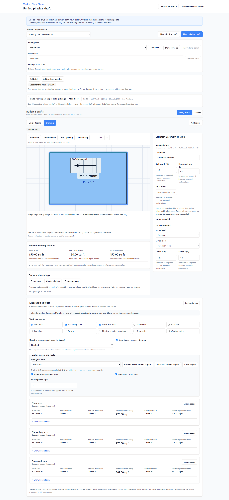
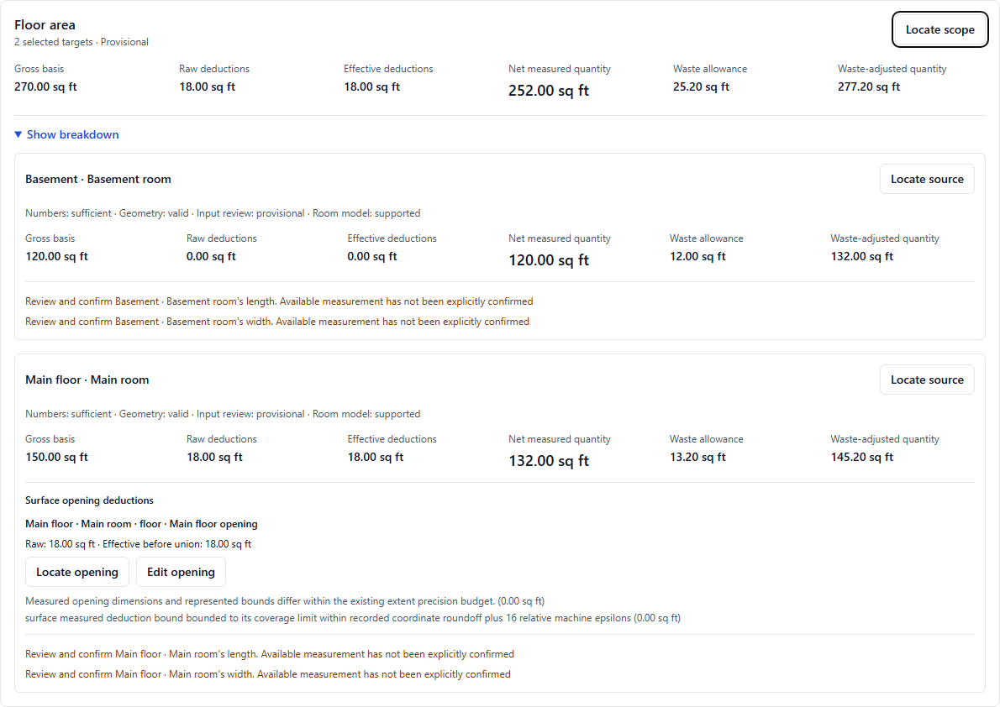
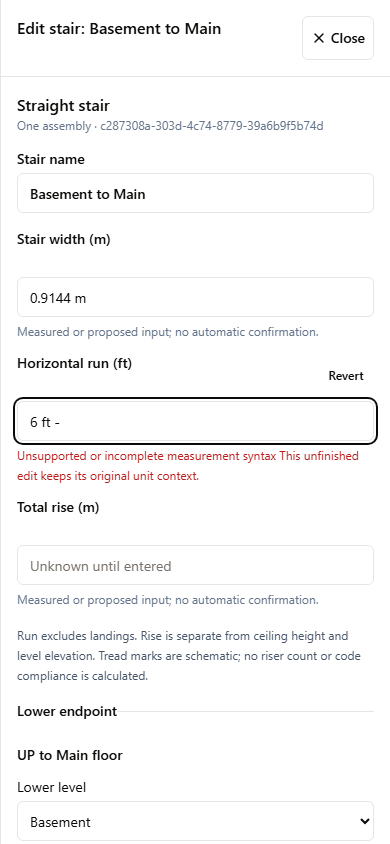

# M3D linked straight stairs, landings and surface-opening results

Date: 2026-09-09. **Assigned slice COMPLETE / PRODUCER_VERIFIED locally; NOT DEPLOYED.**

Implementation [#17](https://github.com/armentrout1/ModernFloorPlanner/issues/17), broader requirements [#9](https://github.com/armentrout1/ModernFloorPlanner/issues/9), completed levels [#16](https://github.com/armentrout1/ModernFloorPlanner/issues/16).

Entry main/origin/main: `e17a6f37b16c1fcdfbd9a56ded7ac0ade13ffb1a`. Application/test commit: `6ed8ad911777d687e76be832f7aaa67cf4a9de8f`. The owner directly authorized publication. This report and the canonical roadmap accompany the application commit; final commit and publication evidence are recorded in the linked issue closeout. M3D as a whole is not complete.

## Fresh final integration checks

Node 20.20.2, npm 10.8.2, Playwright 1.55.1. One fresh full sequence ran after the last application/test edit, in the isolated source export. All 263 normalized source hashes match the canonical application commit. [Source/check manifest](evidence/MFP_M3D_STAIRS_2026-09-09.json) includes command times/durations, exact source hashes and screenshot hashes. The original 437 unit and 158 browser regressions remain, with 38 new unit and 8 new browser cases. Two predecessor storage assertions changed only for the added fallback-key read and new recovery-envelope version; content assertions remain.

| Exact command | Actual result | Duration |
| --- | --- | --- |
| `npm ci` | PASS | 10.20s |
| `npm test` | 475/475 PASS | 4.42s |
| `npm run check` | PASS | 6.20s |
| `npm run build` | PASS | 4.50s |
| `npx playwright test --reporter=line` | 166/166 PASS; zero failures/retries/skips | 454.16s |
| `git diff --check` / staged check | PASS | Before commit |
| Frozen source equals canonical source | PASS, 263 files | Before/after integration |
| Separate canonical UI smoke | 1/1 PASS at5185 | 15.21s |

Install reports 28 existing dependency audit findings (4 low,10 moderate,14 high). Build retains the older Browserslist data and large-chunk warnings. The locked dependencies/runtime were not changed in this bounded slice.

Earlier attempts are not combined with this full run: preliminary01 core0/1 exposed a schema4 active-level filter mismatch; preliminary02 core1/1 passed after correction. Preliminary03 was4/8: three assertions expected different existing error/dialog wording, and one pointer-release precision failure was real. Preliminary04 was build-only. Preliminary05 is a separate focused8/8 after pointer precision, same-level error clarity, evidence-preserving history normalization, inline invalid-field blur and the phone Revert label space were corrected. The first full run then finished165/166 in550.196s: the new source-navigation test checked drawer visibility before the asynchronous breakpoint transition had opened the focused inspector. That test now explicitly awaits the intended drawer before closing it; no forced click, timeout increase or application change was used. The failed run and its source/logs are retained separately. A fresh install and entire required sequence were repeated after that final test edit. The final run above remains the acceptance source.

## UI and numeric acceptance

All eight `physical-stairs.spec.ts` workflows pass in the final full run. The core fixture is entered through the real UI, including the new explicit upgrade, dimensions, placements, endpoint landing and surface choices. Recovery is read back through the production validator; no authoritative totals are seeded. Browser/Node parity separately compares complete engine results/fingerprints.

| Acceptance | Actual result |
| --- | --- |
| A–B: lower/upper selection, shared dimensions and landing | One shared ID; correct UP/DOWN labels; shared width/run; independent room-local placements |
| C: level names/order, ceiling height, unresolved destination | Connection roles stable; level elevations and missing rise stay unknown |
| D: all impacts explicitly no deduction | Floor270, flat ceiling 270, gross walls 802 sq ft; no footprint/landing adjustment |
| E: Main floor internal3×6ft opening | Deduction18; Main132, Basement120, project floor 252; ceiling 270 and walls 802 unchanged |
| F: explicit Basement ceiling3×6ft opening | Basement 102, Main 150, project ceiling 252; floor 252 |
| G: floor 10% waste | Net 252, allowance 25.2, adjusted 277.2 sq ft; switching editing level preserves work/totals |
| Surface readiness/union | Unknown/invalid opening input or unresolved impacts block affected nets; gross is retained when room dimensions and surface applicability are supported; overlapping coverage deducts once; duplicate attachments rejected |
| Guarded pointer positioning | Current zoom/drawer bounds, final release coordinate, one transaction; stale/modified gestures cancel |
| Dependencies/history | Room reassign/delete guards; deleting stair preserves holes; deleting hole leaves unresolved impact; Undo/Redo preserves IDs/evidence and unrelated pending text |
| Phone/raw input/recovery | Unit context, IME/layout transitions, Revert, no overlap, reload with empty session history; unsupported/quota bytes preserved |
| Locate/Edit source | Correct level/room/surface opens without changing work scope or pending stair text |
| Compatibility | Historical v1/v2/v3 snapshots and schema2/3 preserved; current snapshot validation and browser/Node parity pass |

The dimensions are synthetic arithmetic fixtures, not prescribed safe stairwell or structural design.

## Implemented stair, landing and surface-opening contract

Physical document schema 4 requires `stairsContract.version = straight-stairs-v1` alongside the existing `building-levels-v1` ownership contract. One stair assembly has a stable ID and name, shared width, horizontal run and separately recorded total rise. Its lower and upper endpoints are explicit roles, each either unresolved with a reason or modeled with an exact level, room and room-local placement. Two modeled endpoints must belong to different levels, and each room must belong to the stated level. Names, display order, ceiling heights and drawing positions do not establish vertical direction.

Each endpoint can have one separate rectangular landing with its own stable ID, width, depth and placement. The stair run excludes these landing dimensions. A landing requires a modeled endpoint. The schema rejects missing references, duplicate identities, incompatible versions and invalid attachment relationships. Existing room/group/shared-wall-opening ownership rules continue to apply. Host room reassignment and deletion identify the new stair, landing or surface-opening dependencies rather than silently relocating related geometry.

Level finished-floor elevations remain explicit unknown-only values. A manually entered stair total rise keeps its own measurement provenance and does not write either level's elevation or derive from a room ceiling height. An unresolved endpoint and unknown rise remain visible incomplete information. The independent `alignment` state records whether room-local placements were reviewed; even the reviewed state does not establish surveyed vertical alignment.

Both active-level representations refer to the same stair ID and shared dimensions. Lower and upper endpoint placements remain independent. The lower representation points UP toward the upper destination; the upper representation points DOWN toward the lower destination. Destination text uses the explicit endpoint connection even after a level rename or display reorder. Selection, destination navigation and pointer placement use the existing physical drawing and inspector/drawer. Hidden-level representations do not become hit targets.

## Exact supported plan geometry

The placement anchor is `room-local-top-left`: X and Y locate the top-left corner of the rotated axis-aligned bounding rectangle in the host room. X increases rightward and Y downward. Allowed rotations are 0, 90, 180 and 270 degrees clockwise. A straight stair's horizontal run follows positive X at 0 degrees, positive Y at 90, negative X at 180 and negative Y at 270; width is perpendicular to the run. UP follows that direction, and DOWN uses the opposite arrow. The anchor remains the bounding rectangle's top-left when rotated; it is not an implied pivot point or a surveyed building coordinate.

For landings, width follows local X and depth local Y at zero rotation. For surface openings, width follows local X and length local Y. Rotations of 90 or 270 swap the displayed bounding dimensions. Repeated stair marks are schematic. Neither their count nor spacing is recorded tread/riser engineering.

Stair and landing footprints use the existing 0.01 mm fit tolerance with its bounded floating-point comparison allowance. Negative coordinates can remain explicit measurement data and receive fit findings rather than being silently moved into the room. Unknown dimensions or coordinates produce undetermined fit. Range checks reject non-finite or unsupported extents and materially lost coordinate spans; the existing extent precision allowance is `1e-9 mm + 16 * Number.EPSILON * abs(extent)`.

Surface openings are stricter: this slice supports only rectangles fully inside the selected rectangular floor or flat ceiling. Each side must have positive clearance from the room boundary. Boundary-touching or boundary-cutting data is unsupported even when its difference is within the stair fit tolerance. It is not clipped into a valid opening. Structurally valid unresolved or non-fitting geometry is retained with findings. Malformed references and incompatible contracts are rejected without rewriting their original recovery/source data.

Numeric edits use the existing pending-input and Apply/Revert patterns. A supported pointer repositioning uses current rendered bounds and the existing physical transforms, then commits one guarded transaction. Draft/target revision checks and gesture cancellation protect against a late release after view, level or draft change. Failed placements and physical no-ops do not create committed history.

## Surface effects, readiness and quantity trace

A surface opening is a separate physical entity with its own ID, name, width, length, measurement evidence and one or more distinct `{roomId, surface, placement}` attachments. Surface is explicitly floor or ceiling. The optional stair association does not replace these attachments or derive the opening from the stair footprint. This entity is distinct from the existing floor-level opening in a wall.

Every modeled stair endpoint has independent floor and ceiling impact states: unresolved, no deduction, or deduct specified surface-opening IDs. A referenced deduction must name an opening attached to that exact room and finish surface. An independently modeled attached opening still affects its surface even if it is unassociated or the stair's own impact is marked no deduction; the UI explains this distinction. Multiple references to the same attached hole do not repeat the deduction.

No stair footprint is automatically subtracted. No landing already inside a measured room adds floor area. A floor attachment does not imply a ceiling attachment, and a cut on one level does not cut another level. Interior surface holes do not change wall finish area, baseboard, base shoe, door/window inventory or casing.

The shared engine receives the full valid document and explicit takeoff request. Active editing level and camera remain separate from selected work. For each selected floor/ceiling target, it calculates gross area, raw opening deductions, effective union deduction, net area, optional waste allowance and adjusted quantity. The existing rectangle-union and guarded arithmetic are reused; React displays the results rather than recalculating deductions. Overlapping coverage is deducted once. A positive gap between rectangles is not bridged by the geometry tolerance. Waste is applied once after net.

Readiness is specific to the affected room and surface. An unresolved stair impact, unknown or needs-review opening measurement, unsupported hole or invalid attachment fit blocks that surface's net. Resolved unconfirmed measurements produce a provisional quantity. A supported flat ceiling can have explicitly modeled internal openings under policy 4; unknown or unsupported ceiling declarations are not cleared automatically. Unknown stair rise, unresolved surveyed alignment and stair/landing fit findings do not globally block an independently specified valid surface opening or unrelated selected outputs.

Version 4 floor/ceiling records and aggregates carry `grossBasis` and `grossBasisStatus` (`complete`, `provisional` or `unavailable`). Gross can remain explainable while net is blocked by an unresolved impact or hole. A gross aggregate covers all selected targets or is unavailable when their gross basis cannot be established; it is not a silently partial project gross. Existing subtotal/partial status continues to distinguish usable selected rows from a complete selected total. Pending raw measurements and waste retain their existing masks, so last committed adjusted amounts are not presented as current while relevant text is unfinished.

Each usable surface deduction has a trace contribution containing opening ID, room ID, surface, raw measured area, represented area before union, raw/effective bounds, boundary adjustment and signed roundoff adjustment. Supported internal holes have zero boundary adjustment. The trace separately identifies coverage-union reduction and floating-point roundoff in square millimeters. Surface source identity remains explicit rather than using a fabricated wall-face ID. Locate/Edit source reveals the corresponding level, room, surface and opening without changing takeoff scope.

The independent two-level arithmetic fixture is Basement 12 by 10 ft with an 8 ft ceiling and Main floor 15 by 10 ft with a 9 ft ceiling. Its expected all-level floor/flat-ceiling/gross-wall quantities are 270/270/802 sq ft. An explicit 3 by 6 ft Main-floor floor opening changes Main floor to 132 and project floor to 252 while Basement floor remains 120 and project ceiling remains 270. A separate explicit Basement ceiling attachment changes its ceiling to 102 and project ceiling to 252 while Main-floor ceiling remains 150. Ten percent floor waste then gives 25.2 allowance and 277.2 adjusted sq ft. These dimensions are synthetic arithmetic fixtures, not prescribed safe stairwell dimensions. Actual UI execution and parity passed as recorded above.

## Version compatibility and immutable captures

The new tuple is physical schema 4, `rectangular-flat-v4`, `rectangular-engine-v4`, `quantity-result-v4` and `quantity-snapshot-v4`. Geometry and content fingerprint scopes are `physical-geometry-v4` and `calculation-content-v4`. Dispatch is explicit; an older quantity policy cannot silently ignore stairs or surface holes and report an uncut schema-4 surface as complete.

Historical schema-2/schema-3 documents and captured v1/v2/v3 quantity snapshots retain their original interpretation. Their policy branches and fingerprint payloads are not redefined by this feature. The frozen snapshot fixtures cover regeneration and verification with their original bytes and hashes, including a captured v3 fixture made before the stair engine change. The final full run verified these fixtures.

Version 4 calculation identity binds level ownership, stair identities/connections, relevant measurements, endpoint/landing placements, surface attachments/effects and alignment state. Calculation content additionally binds measurement provenance and relevant explanatory evidence. Stair/opening/level names, display ordering, active level and camera are excluded from calculation identity; complete snapshot source capture still retains presentation/source values. Snapshots are detached immutable captures, and mismatched result/snapshot/version or fingerprint combinations are rejected.

An explicit upgrade clones the current schema-3 working document and full current editor draft into a new schema-4 draft. `physical-stair-upgrade-v1` lineage retains the exact source draft, ID, revision and timestamp. It preserves pending text and units, requests, source originals, measurements, existing openings/groups, review and history evidence, and any prior level-upgrade lineage. It does not reconstruct the working copy from a stale `source.original` or replace the source registry entry. Only the new working request and compatible deletion-recovery request copies move to policy 4; their prior exact versions remain in lineage.

## History, dependency safety and temporary recovery

The existing single per-draft history coordinator handles stair creation, naming, dimensions, placement, endpoint assignment, landing changes, surface impacts, independent surface openings and deletion. Typed stair entity/part targets use `physical-history-evidence-v3`; older evidence versions cannot claim the new target types. Runtime inverses and recovery replay use the same retained source-before/source-after semantics. Local evidence validates consistency and does not authenticate a user or modify a historical quantity snapshot.

Undo/Redo retains stable IDs and relationships, uses monotonic edit revisions, and reveals the affected level and target without changing quantity scope. One successful drag is one action; raw typing, view changes, rejected or stale commands and physical no-ops do not create committed actions. Accepted in-memory edits retain Undo/Redo when saving temporary recovery fails. The existing 50-action session limit, review boundaries, native input undo protections and guarded targeted wall-opening recovery remain in use.

Restored changed known measurements keep their original evidence but become unconfirmed. Equal measurements remain byte-equivalent, including the untouched Y coordinate or another surface attachment when only one X coordinate changed. Surface attachment matching uses room ID plus surface. Rotation-only restoration does not downgrade unchanged coordinate evidence. Restoring an unchanged deleted entity retains its exact captured measurements/approvals rather than treating every contained field as a newly changed measurement. Pending fields that would be overwritten or lose their owner block the inverse; unrelated pending fields survive.

Deleting a stair explicitly unlinks and retains independently modeled surface openings. Deleting a surface opening preserves the stair and changes referring impacts to unresolved. Undo/Redo applies the relevant entity and impact/association changes atomically, so neither path claims a dangling link or silently deletes the other physical object.

Recovery envelope `mfp-editor-draft-v3` uses `modern-floor-planner:editor-draft:v3`. Existing v2 and v1 keys remain validated read-only fallbacks when newer keys are absent. Older bytes are preserved; unsupported/corrupt newer data does not cause an automatic fallback overwrite. Before the first accepted migration write, the store checks the observed fallback bytes and new-key absence to detect concurrent changes. Quota/read failures retain accepted newer memory and existing recoverable bytes.

Recovery validates the complete supported physical contract, raw field target/owner/value consistency, endpoint and surface references, request, current evidence and full upgrade lineage. Retained earlier evidence must remain an exact prefix after upgrade. Totals are not stored as authority. Reload restores supported current data and starts empty session Undo/Redo stacks. No schema-4 physical document is sent through the lossy legacy plan-save API.

## Scope limits and release boundary

This slice supports one straight flight with optional rectangular endpoint landings and explicit internal rectangular finish-surface openings. It does not implement L/U/winding/spiral or intermediate multi-flight stairs, structural sizing, surveyed level elevations, riser/tread design, code-clearance certification, framing, stringers, rail/guard design, dedicated tread/riser finish quantities or material purchasing. It also does not add a stacked overview, ghost underlay, kitchen/bath tools, trade overlays, new room/group dragging, exports, hosting, accounts or database migration.

React/Vite, the existing drawing renderer and the shared quantity architecture remain. Completion applies only to this assigned M3D stair/landing slice; the broader M3D program remains open. The next eligible already-planned work is a separately bounded fixed-object/zone assignment, which is not started here. M3B, M3C and the building-level slice retain their prior local completion. Issue #10 remains a release tracker, #2 remains unreleased, #4 remains PROPOSED, and unrelated CRM work stays separate.

**NOT DEPLOYED.** Local implementation, test or review evidence does not establish hosted deployment, authenticated customer access, physical-device behavior or accessibility certification. The safe local review route and owner checks are below.

## Genuine visual evidence and safe owner review

Captured from populated final-source isolated browser sessions and inspected; [visual review](evidence/m3d-stairs/VISUAL_REVIEW.md):

Fresh canonical review: [http://127.0.0.1:5185/physical-draft](http://127.0.0.1:5185/physical-draft), HTTP200, Vite listener 38480, source`6ed8ad911777d687e76be832f7aaa67cf4a9de8f`. A separate fresh-context canonical UI smoke passes1/1. Protected 5184 listener 38368/parent 27736 was reverified and stopped immediately before source integration;5184 was not restarted. No owner tab was read, reloaded or used as a test fixture. The new origin does not contain the old tab's draft. Git commits do not store browser-memory drafts. Stash`779950aeaa1b81fc8955ad8f399ab87ae5e59063` and archived original roadmap SHA256`4AA44769A3AF1CC8A4FE940B09E024109FEA19630F61181772B42F7EFDB7BCF1` are unchanged.

Three short owner checks on a disposable new building draft:

1. Add rooms on Basement and Main floor, then choose **Enable stairs and surface openings**. Add a stair, enter width/run and both endpoint rooms/positions. Switch levels and confirm UP/DOWN labels and the same shared dimensions.
2. Review the four finish impacts, then add a separate floor opening on Main. Select its dimensions and internal position; check the explicit deduction and use **Locate opening**/**Edit opening** from the takeoff trace.
3. Change a stair measurement, Undo/Redo, then try the inspector at phone width. Leave unfinished text and use Revert; check that the field and other endpoint remain intact.

No hosted, database, authentication, partner or production smoke was performed. Local viewport/touch emulation is not physical-device or accessibility certification. No implementation/acceptance blocker remains for this bounded slice; incomplete geometry/impacts are intentionally reported. **Next: one bounded M3D minimal fixed-object/room-use/zone assignment, NOT STARTED.**
