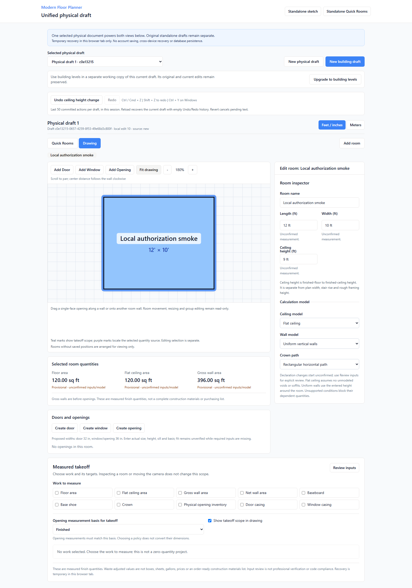
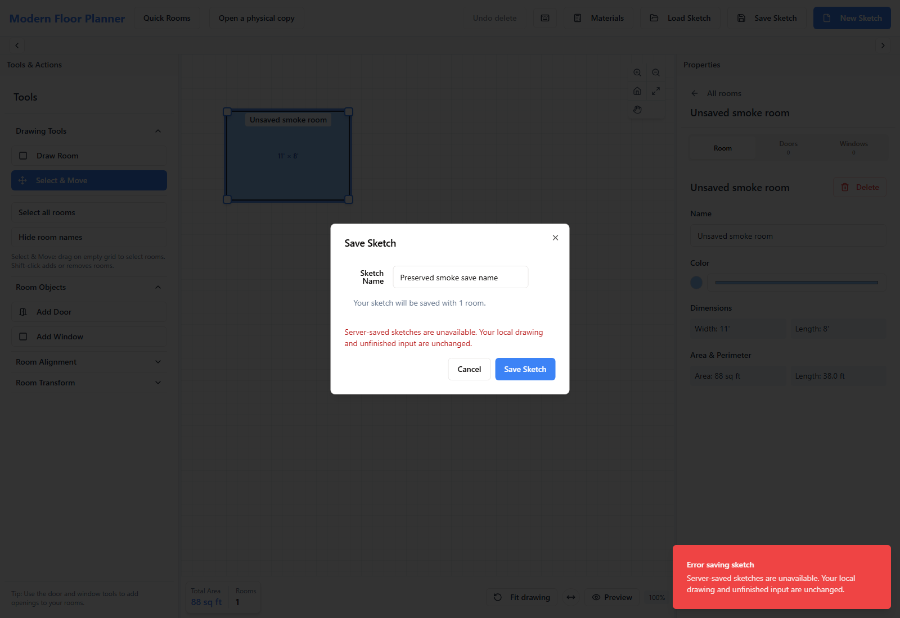
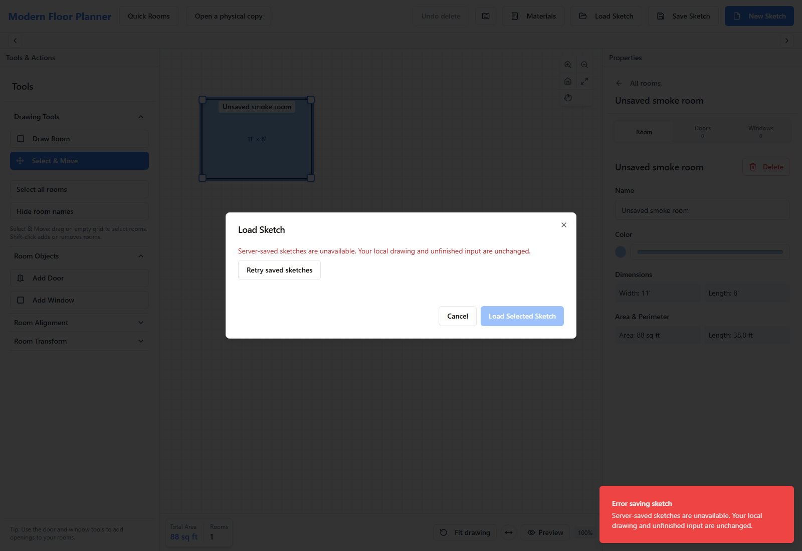

# M4A authorization foundation results

Date: 2026-09-09. Assigned slice: [issue #19](https://github.com/armentrout1/ModernFloorPlanner/issues/19). Entry main: `c0b9b777c2277a3a1470bc5c0dec08025242bc07`. Status: **COMPLETE / PRODUCER_VERIFIED locally**; **NOT DEPLOYED**. This report concerns the authorization foundation, not all M4A.

## Configuration and decision

The owner intends Vercel. No repository-local deployment link or environment configuration was present. Read-only Vercel metadata listed one available team and no project linked to `armentrout1/ModernFloorPlanner`; no deployment was created or verified. Historical Replit configuration does not prove hosting.

The actual driver is Postgres.js through Drizzle's postgres-js adapter. No configured `DATABASE_URL` or live database binding was found or used. Installed Passport/session packages and `users.password` remain inactive scaffolding. No identity provider is selected. Normal application composition returns a sanitized unavailable response before constructing database storage; no headers, environment switches, old injection argument, browser state or fallback users establish identity.

The next M4A decision is selection of the real identity provider and verified issuer/session adapter for `server/identity.ts`, together with the exact trusted application origin. The provider must verify signature/issuer/audience/expiry and revocation as appropriate; the current interface is not token verification. Its future server session must follow the secure HttpOnly `__Host-` cookie policy. No password or token service was built and no cookie is issued here.

## Implemented boundary

All existing `/api/floor-plans` list/create and `/:id` get/patch/delete paths now require a server-established issuer/subject, explicit workspace selection, current active membership and permission. `x-mfp-workspace-id` is selection only. Ownership is stored outside room JSON. No global legacy endpoint remains. The separate test entrypoint supplies synthetic identity/workspace fixtures; production accepts no fixture injection argument or request/environment bypass.

| Active role | Read workspace records | Create/update/delete records | Rename workspace / administer memberships |
| --- | --- | --- | --- |
| Owner | Yes | Yes | Yes, same workspace |
| Editor | Yes | Yes | No |
| Viewer | Yes | No | No |
| Missing/revoked | No | No | No |

Workspace endpoints are `GET/PATCH /api/workspaces/:workspaceId`, `GET /api/workspaces/:workspaceId/memberships` and `PATCH /api/workspaces/:workspaceId/memberships/:principalId`. This slice can update existing memberships; it has no public bootstrap, self-enrollment, invitations or account/workspace UI. The last active owner cannot be demoted or revoked through membership administration.

Repositories resolve current principal/identity/membership and execute workspace-scoped SQL in one transaction. Ordinary operations hold shared workspace, identity/principal and membership row locks. Workspace/membership changes take the conflicting exclusive workspace lock. Mutations retain workspace plus record-ID predicates and strict payload validation; nested drawing fields confer no authority. A mutation holding authorization locks may finish before a simultaneous revocation; subsequent operations after committed revocation deny.

Every supported mutation requires an exact configured trusted Origin and `X-MFP-Request: 1`, including test bearer requests. Host/forwarded headers never establish trust, and no CORS access is enabled. API responses are private/no-store before parsing, on successes and errors. Missing/nonmember/unowned/foreign records use the same sanitized 404; insufficient active role uses 403; invalid/expired/revoked/absent identity uses 401; missing verifier or storage failure uses sanitized 503. No credential or private response body is logged.

The identity result distinguishes absent, expired, revoked, invalid and unavailable internally. The real provider's session lifecycle, session revocation and cross-account browser behavior are not verified by a test adapter.

## Additive schema and preservation

`migrations/0001_workspace_authorization.sql` adds application principals, issuer/subject external identities, workspaces, role/status memberships, and nullable indexed `floor_plans.workspace_id`. Existing users and room payloads remain unchanged. Existing plans retain NULL ownership and remain inaccessible. There is no automatic migration, backfill, first-user assignment or destructive rollback. The once-only transaction refuses an unexpected existing schema rather than silently accepting it.

Migration tests use only the dedicated loopback PostgreSQL 17.5 cluster, explicit synthetic test database and a unique test schema after verifying the actual data directory. No live or unidentified connection, `db:push`, hosted database, RLS policy or production migration is part of this result.

Schema-5 physical documents, historical snapshots, levels, stairs, zones, cabinets, quantities, history and recovery remain unchanged. Legacy payloads remain room-only; full physical cloud saving is still M4B. The API client now distinguishes access/unavailable errors; Save keeps pending names/drawings, Load clears stale inaccessible rows, ignores outdated list responses and rechecks record access before loading. No anonymous draft is uploaded or assigned automatically. Real account-transition/local-draft protection remains the next slice.

## Checks and publication

Implementation commit: [d4f6bb5471dca2d0347c94499226b73e17ac4093](https://github.com/armentrout1/ModernFloorPlanner/commit/d4f6bb5471dca2d0347c94499226b73e17ac4093). The final 285-file source/configuration/test/migration manifest has digest 4495765fe12bb2c28241c1eee716da08ee44e0e470724ae9f39d6aa342fb89db; all normalized source hashes match canonical integration. [Machine-readable source/check evidence](evidence/MFP_M4A_AUTHORIZATION_2026-09-09.json).

| Check | Actual final result | Command time |
| --- | --- | --- |
| npm ci | PASS | 10.047 s |
| npm test | 535/535 PASS | 4.763 s |
| npm run check | PASS | 6.515 s |
| npm run build | PASS | 4.577 s |
| npx playwright test --reporter=line | 180/180 PASS | 533.861 s |
| npm run test:authorization:db | 15/15 PASS; actual PostgreSQL | 3.401 s |
| git diff --check; git diff --cached --check | PASS for integrated implementation and final documentation | At each commit |

The final commands ran sequentially after the last application/test edit. Zero failures, skips or cancelled tests; browser retries are zero. Node 20.20.2, npm 10.8.2, Playwright 1.55.1, PostgreSQL 17.5. The preceding 516 unit and 174 browser behaviors remain included. Nineteen additional HTTP cases are included in 535; fifteen PostgreSQL cases are separate, and six additional browser cases bring the unfiltered total to 180.

Post-integration canonical build: PASS. Separate normal-composition smoke at [fresh loopback review 5187](http://127.0.0.1:5187/physical-draft): **8/8 checks PASS**, 2.485 s harness, zero page errors. Local 12×10×8 to 9 ft editing retains 120/120/396 sq ft results, performs no automatic upload, and recovers the same synthetic physical draft. Real denied Save/Load preserve pending name and geometry; private CRUD rejects forged identity hints. The fresh origin does not contain the owner's previous drafts.

Only the exact protected 5186 watcher was stopped after its PID, command and actual working directory were reverified immediately before integration. It was not restarted. Owner tabs/storage were not inspected or operated; stash, source exports and archived original roadmap were preserved. Integration copied only 23 assigned implementation/supporting-test files.

Earlier evidence is retained. The first SQL setup attempt rejected the address representation 127.0.0.1/32 before migration; the test guard was corrected to use PostgreSQL's host address while retaining exact loopback/data-directory checks. One predecessor API assertion was deliberately updated from 500 to the new sanitized 503 contract; validation/round-trip/no-write assertions remain. The first full 535/180/15 run passed, but subsequent Git validation found an extra EOF blank line. After removing it, **the complete final sequence above ran again** against the exact final source. Earlier logs and the historical automatic-approval block remain archived; later plain-chat authorization superseded that block.

Install reported 28 dependency vulnerabilities (4 low, 10 moderate, 14 high). Build retained stale Browserslist-data and large-bundle warnings. No blanket upgrades were made; runtime/dependency readiness remains #4. Local passing checks are not deployment approval.

Publication uses implementation plus documentation/evidence commits on main without force or history rewriting. This report's documentation commit and verified GitHub convergence are recorded in the [issue #19 closeout](https://github.com/armentrout1/ModernFloorPlanner/issues/19) after publication.

| Acceptance boundary | Actual evidence |
| --- | --- |
| Identity denial and production fixture isolation | 19 HTTP cases include absent/expired/revoked/invalid/unavailable identity, forged inputs and the normal composition. A test adapter does not prove a live provider. |
| Role and workspace/resource isolation | HTTP checks plus 15 real PostgreSQL cases exercise owner/editor/viewer, two workspaces, scoped CRUD, issuer/subject identity and actual HTTP-to-SQL operations. |
| Revocation at mutation time | PostgreSQL lock tests cover waiting mutation/rechecked role, revocation waiting for authorized commit, and simultaneous owner demotions. |
| Legacy ownership and SQL constraints | Actual additive migration preserves old user/payload rows; NULL-owned plans stay inaccessible. Forged ownership cannot move a record. |
| Browser denial preservation | Six browser cases cover real normal-composition Save/Load denial, simulated 401/403/404 responses, selected-record recheck, stale-list rejection and pending input/IME preservation. |
| Existing physical behavior | Full 535/180 suite and separate canonical smoke retain local calculations, drawing, historical snapshots, history and recovery; no schema-5 cloud saving claim. |

## Remaining boundaries

No actual provider, production database or deployment has been connected or verified; no customer onboarding is enabled. Runtime/dependency release readiness remains #4 PROPOSED, #10 remains release tracking, #2 is unreleased, #9 stays open for broader building work, and CRM is separate. M4A is not complete as a whole. Next: real provider/session integration and account/workspace interface with explicit transition and local-draft safeguards. M4B then supplies complete versioned saving/revisions/conflicts; M4C supplies authorized exports and remaining project-management flows. No M4B/M4C implementation starts here.

## Sanitized local smoke captures

